# 1. Introduction to GNU Radio and Signals

This page shall guide you through our primary tool -- GNU Radio. GNU Radio is very popular and robust Software defined radio package. It is open source and is relatively very easy to use. All "coding" is done using flowgraphs comprised of  interconnected Digital Signal Processing (DSP) blocks. Most commonly used blocks come predefined as part of the software package however  one can program their own blocks as well. 


<!-- TOC -->

- [1. Introduction to GNU Radio and Signals](#1-introduction-to-gnu-radio-and-signals)
    - [1.1. Installation Guide](#11-installation-guide)
        - [1.1.1. Getting Started with GNU Radio](#111-getting-started-with-gnu-radio)
    - [1.2. Let's get Familiar](#12-lets-get-familiar)
        - [1.2.1. A Cosine Waveform generator](#121-a-cosine-waveform-generator)
        - [1.2.2. A Cosine Waveform Generator with Variable Frequency and Sound](#122-a-cosine-waveform-generator-with-variable-frequency-and-sound)
        - [1.2.3. A General Waveform Generator](#123-a-general-waveform-generator)
    - [1.3. GNU Radio and Python](#13-gnu-radio-and-python)
        - [1.3.1. Arbitrary Function generation](#131-arbitrary-function-generation)
    - [1.4. Note on the Frequency Display](#14-note-on-the-frequency-display)
    - [1.5. Exercises](#15-exercises)

<!-- /TOC -->

## 1.1. Installation Guide

It is relative very easy to install *if you are installing on Linux*. We would recommend working on linux however installing on a macOS or windows system is, albiet very hard, possible. First, we install dependences and change directory to the appropriate one.

Open terminal, ( open by right clicking on desktop and choosing open terminal from menu)

```bash
	sudo apt-get install git
	sudo apt-get install libyaml-dev
	sudo apt-get install libssl-dev
	sudo apt-get install python-dev
	sudo apt-get install python-pip
	sudo apt-get install python-apt
	sudo pip install pyopengl pyopengl_accelerate
```
In your home directory make a directory where we would install gnuradio:

```bash
	mkdir ~/gnuradio
	cd ~/gnuradio
```

To always have the most recent version of the sofware, we use *PyBOMBS*. It is a package manager with all the latest version version of the sdr software. We install the package manager and then we add the 'recipes' to the package manager:

```bash
	sudo pip install --upgrade pip
	sudo pip install pybombs
	pybombs recipes add gr-recipes git+https://github.com/gnuradio/gr-recipes.git
	pybombs recipes add gr-etcetera git+https://github.com/gnuradio/gr-etcetera.git 
```

Install ``gnuradio`` and the hardware drivers for gnuradio, ``gr-osmosdr``. We will also install an app called ``gqrx``:

```bash
	pybombs prefix init ~/gnuradio -a myprefix #kind of tells the package manager the directory where to arrange all installs within
	pybombs install gnuradio gr-osmosdr
	pybombs install gqrx
```
Add the environmental variables script to ``.bashrc``

```bash
	echo "source ~/gnuradio/setup_env.sh" >> ~/.bashrc
```

The hardware we use requires us to tell the computer to allow us to use our device:

```bash
cd ~/gnuradio/src/airspy/
cd build
cmake ../ -DINSTALL_UDEV_RULES=ON
make
sudo make install
sudo ldconfig
cp ../airspy-tools/52-airspy.rules /etc/udev/rules.d/
sudo ldconfig
```

Restart Computer to make all the changes work.

Plug in the box into the USB port. Open terminal and type ``airspy_info``. It should display some hardware info about the device. 

----
*For other hardware devices, the files in the ``~/gnuradio/src/`` directory are drivers for them. Move into them and follow similar procedure as mentioned above. Look for the correct for each ``.rules`` files in their directory and copy it into ``/etc/udev/rules.d/``*
----

<!--
Sanity check as to whether the hardware is working (tunes to an local FM radio station at 100.1 Mhz) 

```bash
	rtl_fm -f 100.1e6 -M wbfm -s 200000 -r 48000 - | aplay -r 48k -f S16_LE
    
	#alteratively
	rtl_test -t
```-->

[↑ Go to the Top of the Page](#)

### 1.1.1. Getting Started with GNU Radio

We start start right away by typing ``gnuradio-companion`` in the terminal:

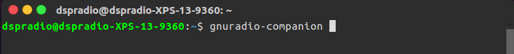

This opens GNU Radio Companion (GRC):


The “Options” block at the top left is used to set some general parameters of the flowgraph, such as metadata of the flowgraph like the title, author, etc., the graphical user interface (GUI) for widgets and result displays, or the size of the canvas on which the DSP blocks are placed. Right-click on the block and click on Properties (or double-click on the block) to see all the parameters that can be set. Below the Options block is a “Variable” block that is used to set values to variables that are used throughout the flowgraph like the sample rate, e.g.,\\(F_s = 32000 Hz\\) 

 

Every GRC window has these two very basic blocks. The white space is called the GRC canvas.

[↑ Go to the Top of the Page](#)

## 1.2. Let's get Familiar

On the right side of the window is a list of the block categories that are available. Click on a triangle next to a category to see what blocks are available in that category. We will look for the waveform generator category to look for the signal source block. Alternatively, we can click on the magnifying/looking glass to the top right and search for the block we need. We will add the ``signal source`` block to the canvas by double clicking on signal source


To move a block on the canvas, grab it with the cursor, press the left mouse button, and move the block to the desired location. You can also rotate blocks by right-clicking on them and then clicking either “Rotate Counterclockwise” or “Rotate Clockwise”. Blocks can also be temporarily disabled by clicking on “Disable”, which is useful for debugging and what-if questions. The rearranged blocks with the options for the “Signal Source” visible are shown next.

----
**_Aside_**

We notice that the “Signal Source” block has two ports, a grey one on the left and a blue one on the right. The color of a port indicates the type of data generated for an output port or the type of data accepted for an input. The most common data types that we will use are:

- Blue for complex-valued 32-bit floating point data samples (32 bits for each, real and imaginary part).
- Orange for real-valued 32-bit floating point data samples
- Blue-Green for real-valued 32-bit (long) integer data samples
- Yellow for real-valued 16-bit (short) integer data samples
- Magenta for real-valued 8-bit (byte) integer data samples


GNU Radio uses a stream processing model to process large amounts of data in real-time as opposed to a array processing environment (like Matlab). In practice this means that each signal processing block has an independent scheduler running in its own execution thread and each block runs as fast as the CPU, dataflow, and buffer space allows. If there is a hardware source and/or sink that imposes a fixed rate (e.g., 44100 samples/sec for an audio signal, or 10 Msamples/sec for an SDR interface), then that determines the overall processing rate. But if both the source and the sink are implemented purely in software (like a signal generator feeding a time or frequency display), then some form of timing constraint must be imposed in software to limit the processing speed to a specified sampling rate. A special “Throttle” block that we will frequently encounter is used for this purpose. The figure below shows a “Throttle” block connected to the output of the “Signal Source” that we placed earlier. Click on one port follow it by clicking on the other port: this wires the output port of one block to the input port of another block. For the flowgrapg to work both ports must use data of the same type (i.e., both ports must be of the same color). If they are of different types, then the arrow of the connection will be red instead of black. It is worth noticing that the word “Throttle” appears in red on the Throttle block, indicating that there is something *wrong* with this block in the flowgraph. Things that can go wrong are unspecified or undefined parameters or, as is the case above, connections to/from some ports are missing. If you see any red arrows or red writing in a flowgraph you will not be able to run the flowgraph until the offending condition has been fixed.

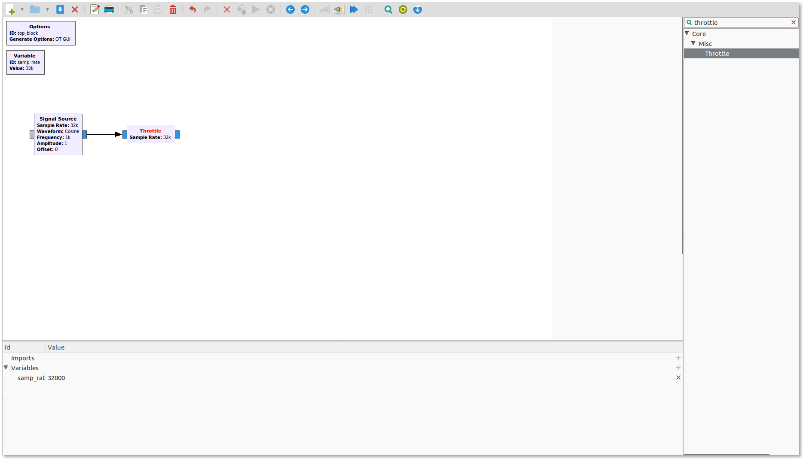

----
[↑ Go to the Top of the Page](#)

### 1.2.1. A Cosine Waveform generator 

As a first experiment we want to generate a real-valued cosine signal with frequency 1000 Hz (default for the “Signal Source”) and display it in the time and frequency domains. We start from a flowgraph which consists of a “Signal Source” connected to a “Throttle”. To make the output of the Signal Source real-valued, double-click on the block and in the Properties window that shows up click on “Complex” under “Output Type” and select “Float” as shown below. Then choose “QT” under “Instrumentation” (or just simply search for “QT GUI Sink”) and double-click on “QT GUI Sink”. This block will allow you to see the waveform at the input in the frequency as well as in the time domain. Change the data “Type” from “Complex” to “Float” and connect the input to the output of the “Throttle” block. Save the flowgraph, e.g., as ex01_1.grc

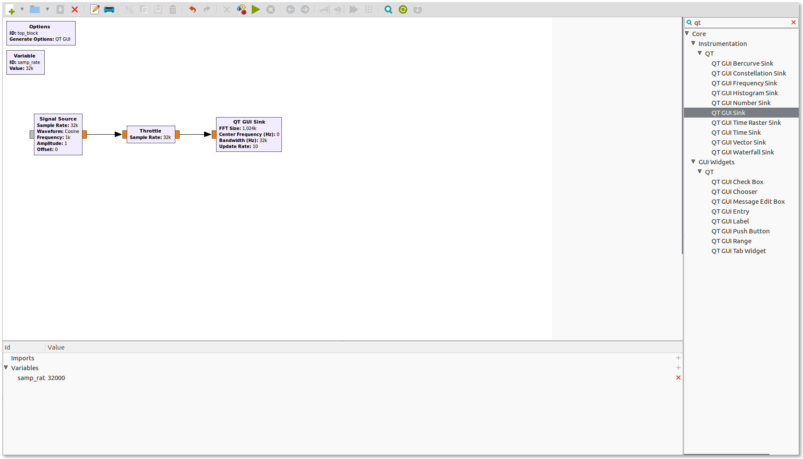

Now you can run the flowgraph by clicking on the green triangle above the canvas or by clicking “Run” on the menu bar. You can choose between the “Frequency Display” and the “Time Domain Display” tabs as shown below. Use the cursor to zoom in on a rectangluar region, increase the FFT size to 4096 or 8192, choose different types of windows, e.g. “rectangular” or “Kaiser” and observe the effects, especially on the Frequency Display. Note that the Frequency Display shows power spectral density (PSD) which is essentially proportional to the magnitude squared of the Fourier transform.

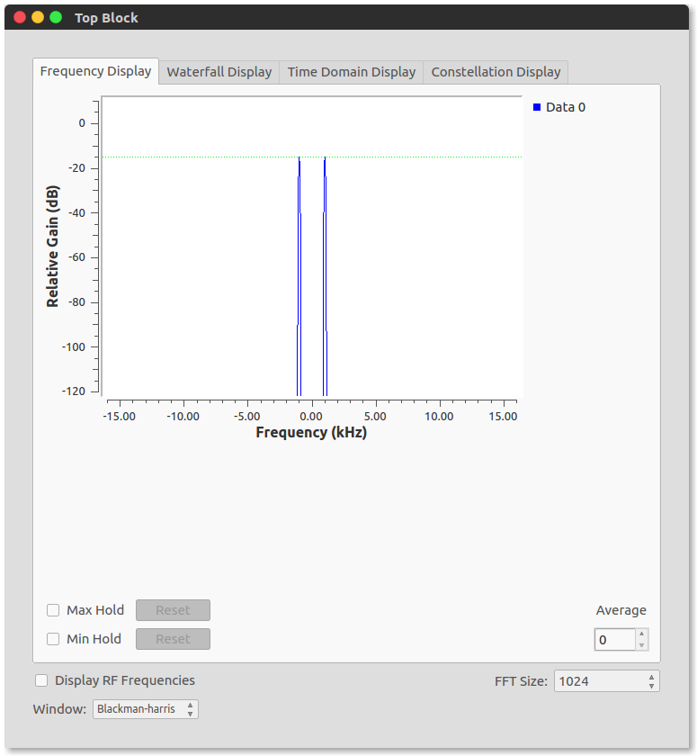 

### 1.2.2. A Cosine Waveform Generator with Variable Frequency and Sound

We can start from the ``ex01_1.grc`` flowgraph from our first exercise. Under “GUI Widgets” and “QT” select “QT GUI Range”. Double- click on the block so that you get to see its Properties. Change the “ID” from ``variable_qtgui_range_0`` to ``f0``. For the “Default Value” enter ``1000``. For the “Start” and the “Stop” values enter ``-2000`` and ``2000``, respectively. Next we double-click on the “Signal Source” block and change the “Frequency” entry from ``1000`` to ``f0``. The respective windows look like below:

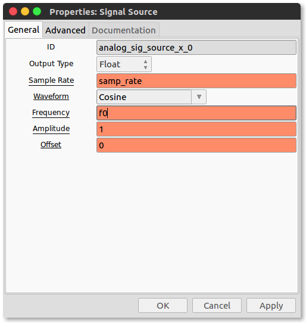

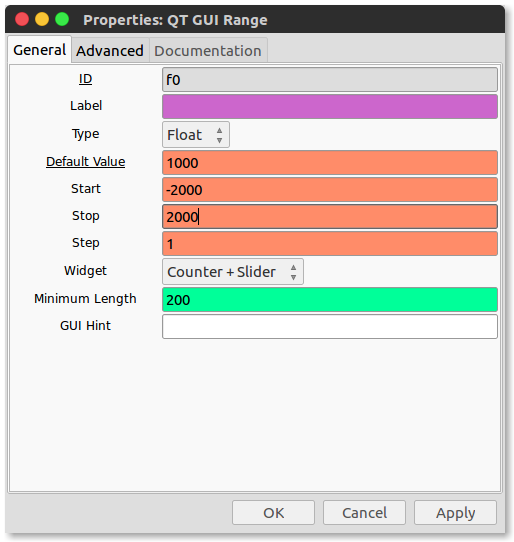

To add a sound output, select “Audio” and then double-click on “Audio Sink”. Connect the “Audio Sink” input to the “Throttle” output and leave the “Sample Rate” at the default value of ``samp_rate (32000 samples/sec)``.

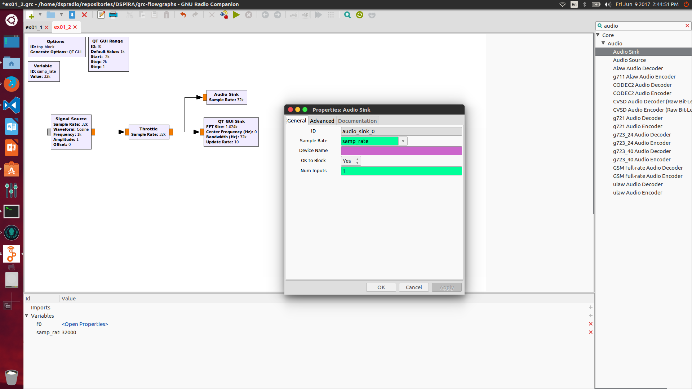

Save the flowgraph, e.g., as ``ex01_2.grc``. If you run the flowgraph now you will get a slider for changing the “Signal Source” frequency from ``-2000 to +2000 Hz``, you will hear the coresponding sound, and you can choose to display the “Frequency” or the “Time Domain” graph.

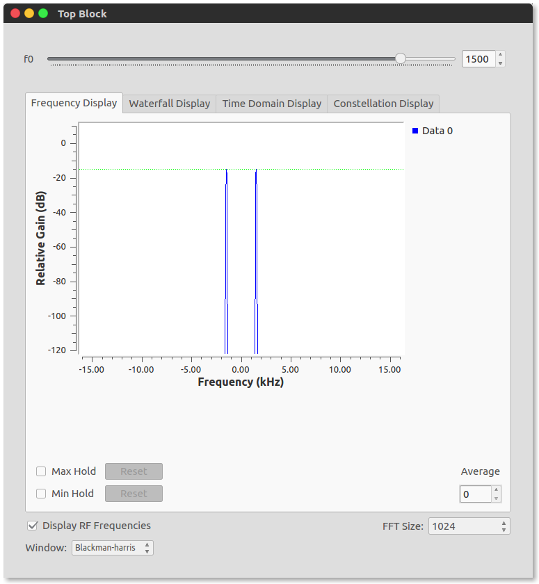

Difference between \\(+ve\ \&\ -ve\\) frequencies?

[↑ Go to the Top of the Page](#)

### 1.2.3. A General Waveform Generator

In this subsection we shall expand upon the previous exercise and learn how to play around with various useful GNU Radio Companion features.  Let us begin by changing ``ex01_2.grc`` flowgraph by removing the “Audio Sink” and the “QT GUI Sink”. Save this new flowgraph as ``ex01_3.grc``

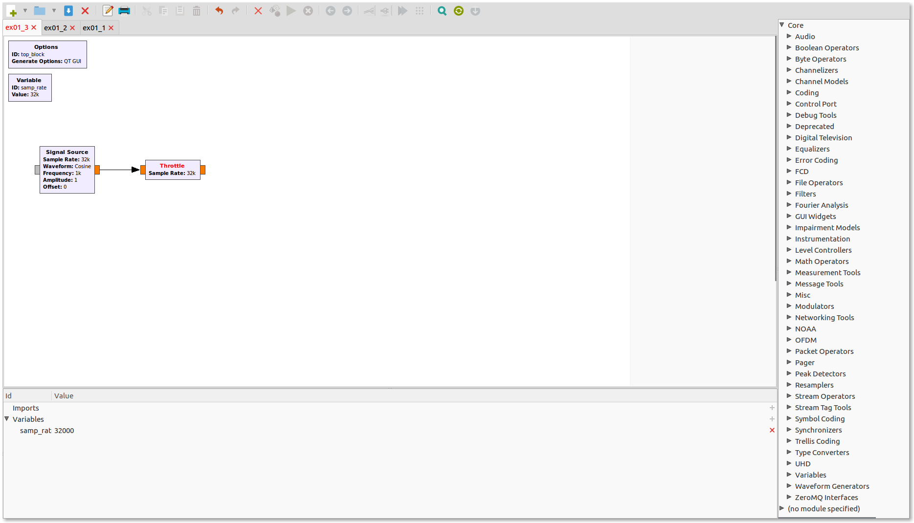

We would like to build a waveform generator that can produce real-valued “Cosine”, “Rectangular”, and “Triangular” waveforms with variable frequency and variable dc offset.  To this end we need “QT GUI Range” blocks and a “QT GUI Chooser (from “GUI Widgets” and “QT”). Connect a “QT GUI Time Sink” and a “QT GUI Frequency Sink” (from “Instrumen- tation” and “QT”) to the output of the “Throttle” Block. Change the input type of the Sink blocks from “Complex” to “Float”. The Flowgraph should look like this:

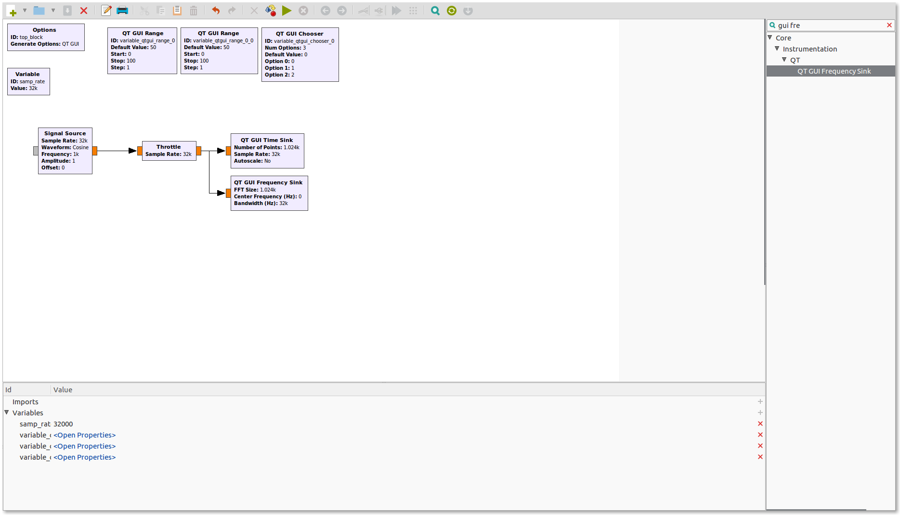

Now, double-click on the second “QT GUI Range” which will be used to adjust the offset of the waveform and modify the “Properties” as shown below:

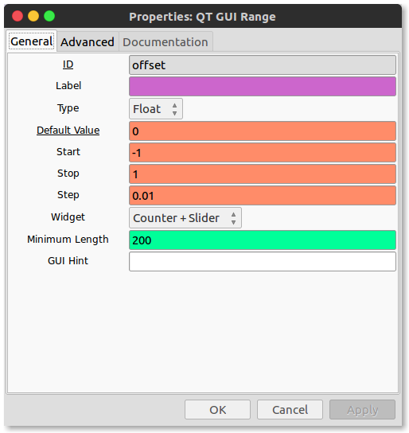

Next, double-click on the “QT GUI Chooser” that will be used to select different waveforms. The (integer) code for “Cosine” is 102, for “Square” it is 103, for “Triangle” it is 104 and for "Sawtooth" it is 105

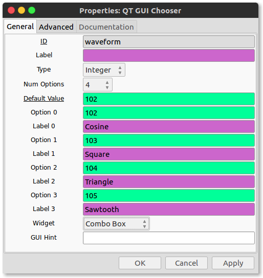

Finally, double-click on the “Signal Source” block and modify the “Properties” to look as follows.

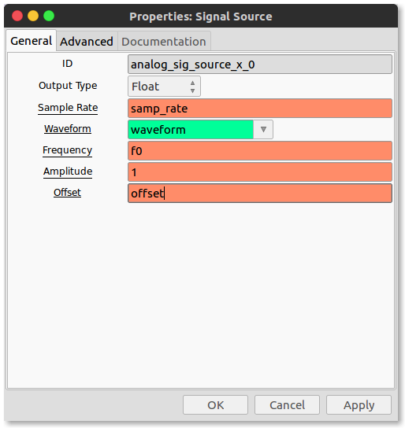

Double click on the sinks and change to autoscale property to "Yes" respectively. Click the green triangle above the flowgraph or click on “Run” and “Execute” in the GRC menu bar. The output is as below:

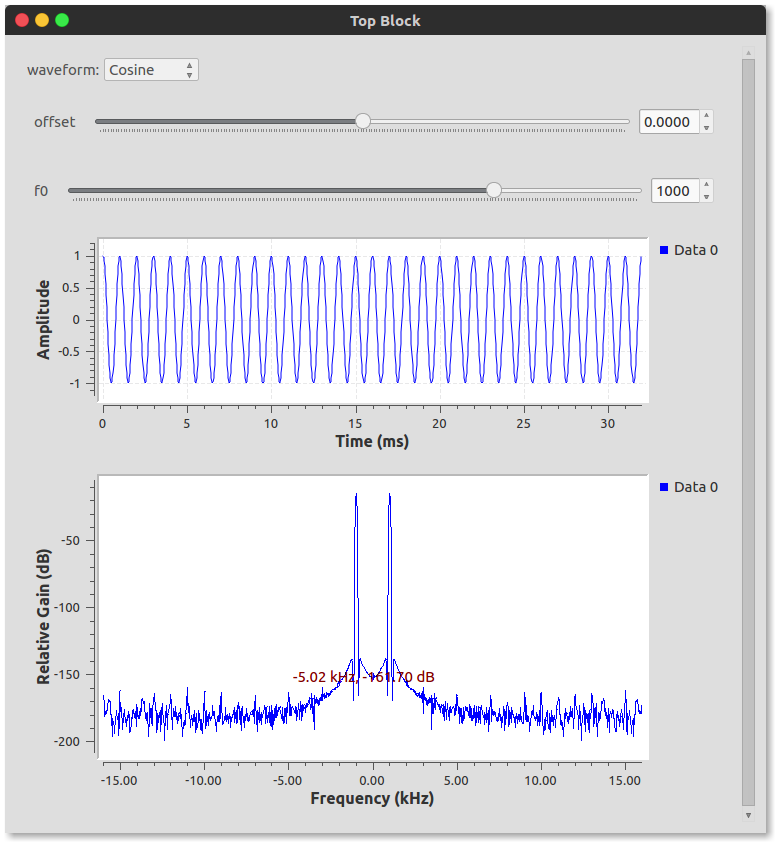

The arrangement of graphical elements, such as sliders, choosers, time and frequency sinks, etc., used in a GRC flowgraph can be modified by specifying grid positioning arguments in the “GUI Hint” fields of individual blocks. A grid positioning argument is a list of four integers of the form

```
row, column, row span, column span
```

If the “GUI Hint” entry is left blank, then the graphical elements are stacked vertically on top of each other. Otherwise, they are placed in the specified ``row``  and the specified ``column``, spanning ``row span`` rows and ``col span`` columns. Note that ``rowspan >= 1`` and ``colspan >= 1`` are required.

|  (0,0) |  (0,1) 	|   (0,2)	|   (0,3)	|   
|---	|---	|---	|---	|---	|
|  (1,0)	|   (1,1)	|   (1,2)	|   (1,3)	|   	
|  (1,0)	|   (1,1)	|   (1,2)	|   (1,3)	|   	


We shall rearrange our signal generator with the following GUI Hints

|Offset Slider (0,0,1,1)    | Waveform Selector (0,1,2,1) | 
|---	|---	|
|Frequency Slider (1,0,1,1) | 				"		  | 
|Time Display (2,0,1,1)		  | Frequency Display (2,1,1,1)|

The GUI hints are updated as seen the following dialog boxes:

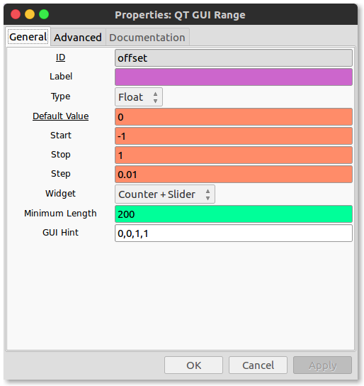
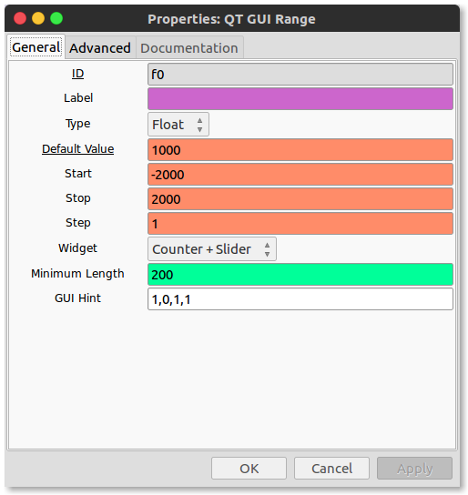
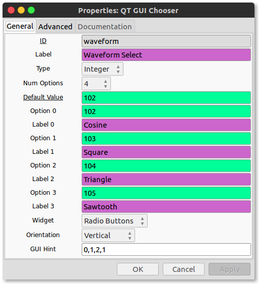
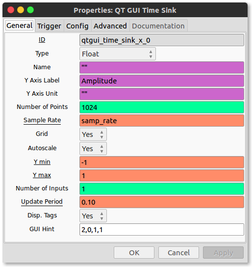
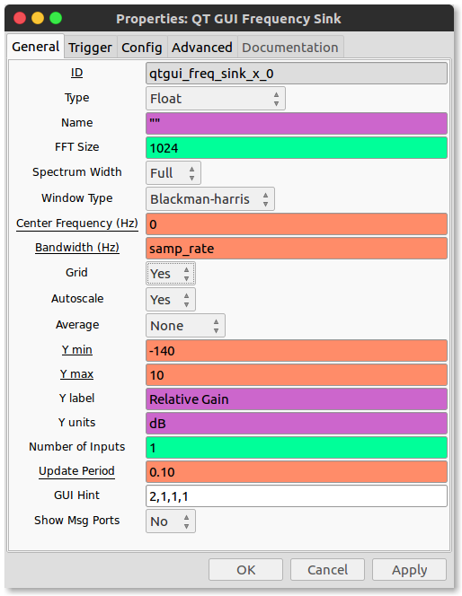

This give the following Output:

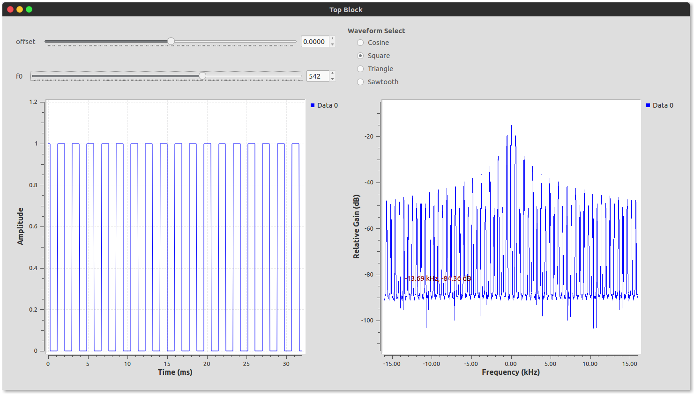

[↑ Go to the Top of the Page](#)

## 1.3. GNU Radio and Python

GNU Radio is written in python and the final code that does the magic is all in Python. Python is very powerful programing language known for its readability and versatility. The flow graphs created in GNU radio companion are converted into a Python script. All the predefined blocks are written in Python and/or C. One can make their own GNU Radio blocks by coding in Python or C. If you want to know how to do this in depth you can click on this guided tutorial [here](https://wiki.gnuradio.org/index.php/Guided_Tutorial_GNU_Radio_in_Python)


### 1.3.1. Arbitrary Function generation 

The fact that the end product and much of the guts of GNU Radio is in Python implied we can exploit the standard library of python or our own scripts to test out severel things. We shall look into making any arbitrary wave form. This is useful for testing systems designed in gnuradio

To import a library from python we use the "import" block and we shall employ the "vector source" block to input our arbitrary function. We shall contruct a flow graph similar to ``ex01_3.grc`` except we remove the "signal source" and replace with "vector source", add an "import block" and we shall not worry about the GUI elements for this one. We should have a flowgraph that looks like this:

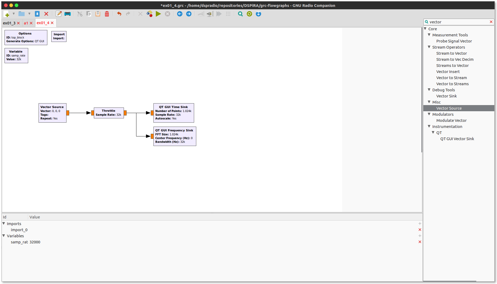

We shall import a standard library called ``numpy``. It allows us to make matrices/vector and manipulate them easily. Double click the import block and fill out the import field as below:

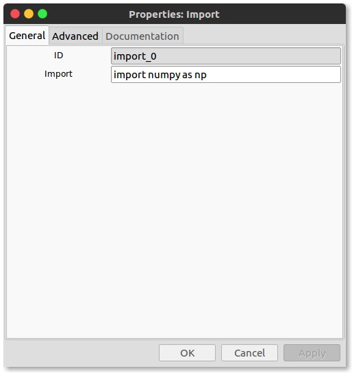

We shall make a rectangular pulse with variable width ``tau`` going from 0 to 10ms, we establish that range using the "QT GUI Range block"  

The function shall be generated shall be generated using the following python code:

```
	np.hstack((np.ones(int(tau*samp_rate)), np.zeros(int((0.1-tau)*samp_rate))))
```

Before we place our blocks, we need to add consider a "Tag Object" block [^stream]. It basically helps us synchronize the sinks when the generated *stream tag* associated with our vector source is stopped by the sink. This will alow us to observe the generated pulse. Vector Source has the “Repeat” field which is set to “Yes” so that the pulse of width tau is repeated periodically. Note the "Tag" field. The properties of the blocks are set as below:

[^stream]: For a technical explaionation of the block [click here](https://gnuradio.org/doc/doxygen/page_stream_tags.html)

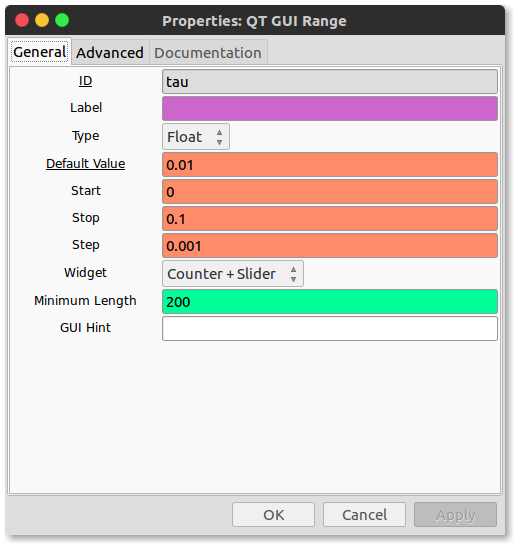
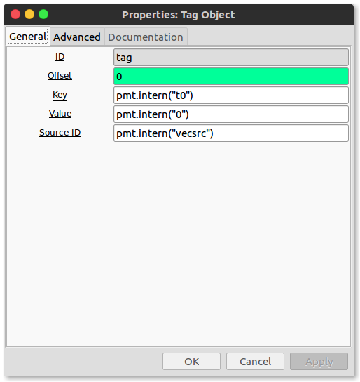
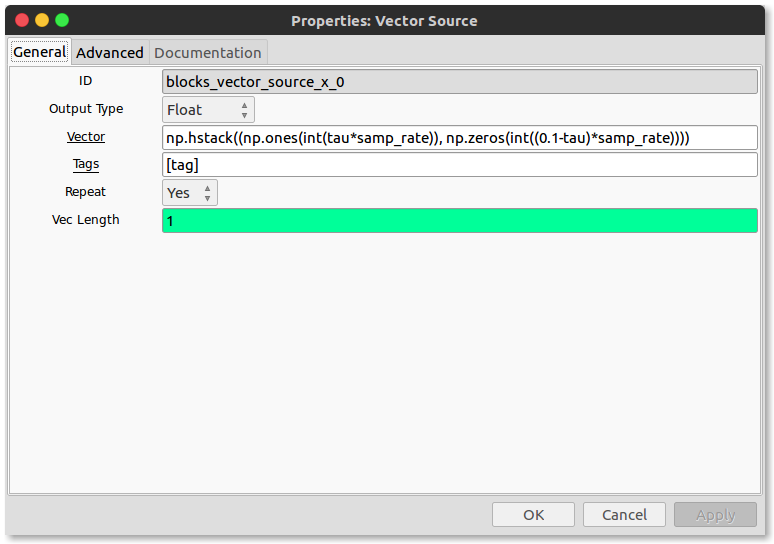

We set the sinks to have the trigger mode to "tag" and  enter the "Tag Key"  ``t0`` and change the "Number of Points" in the time sink to "1024 * 3" and in the frequency sink to "1024 * 6". This is to properly visualize the signal and its frequency components.  

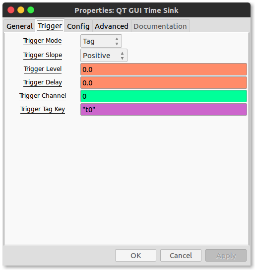
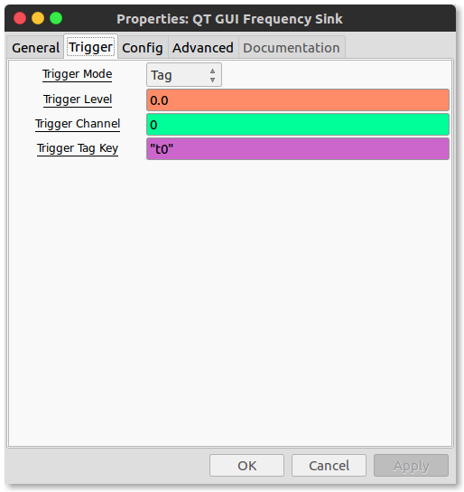

We should then have the flowgraph and output that looks like this:

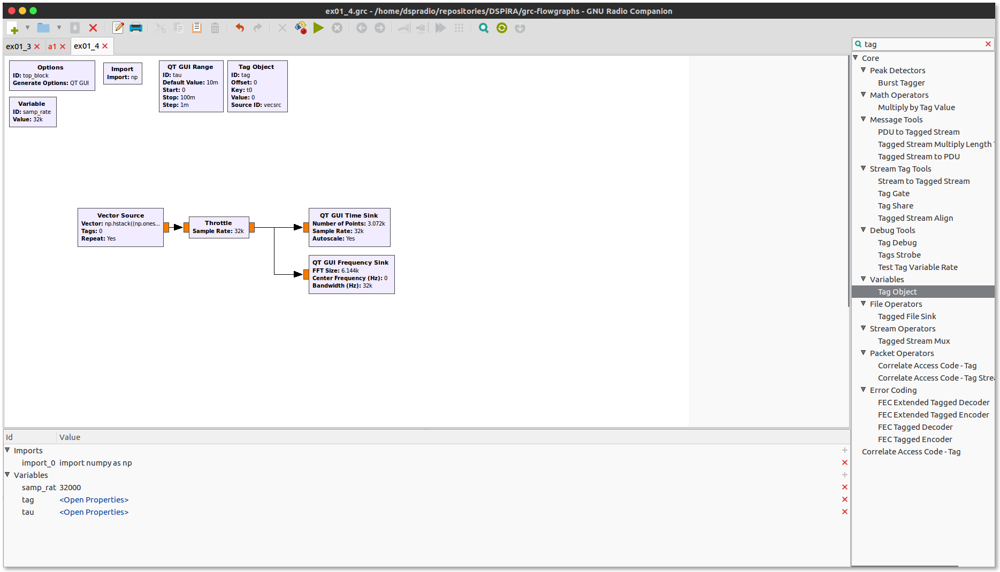
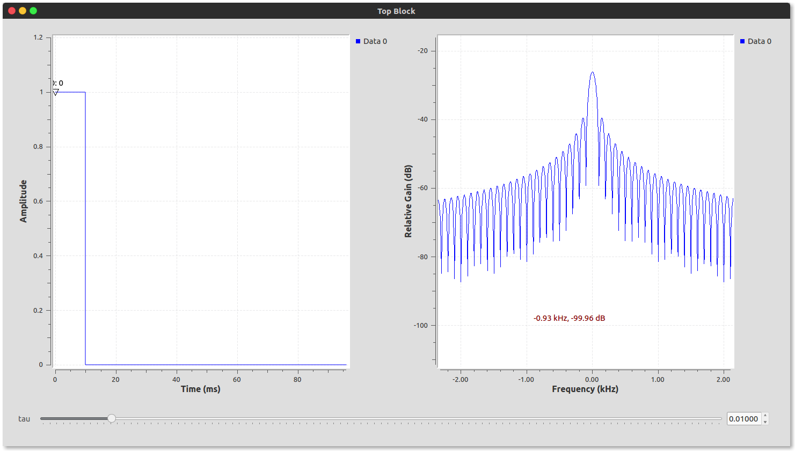

[↑ Go to the Top of the Page](#)

## 1.4. Note on the Frequency Display

This particular display may not seem very intuitive for the those seeing it for the first time. It basically shows, as the name suggests, the 'frequency' components of the signal. This means the peaks in the graph represents the frequencies of the periodic signals that make up that particular signal. This is the basis of a very important concept called Fourier Analysis. Detailed discussions shall be done in class and systematically demonstrated in [Lab 3](../03) and [Lab 5](../05)


## 1.5. Exercises

1. * Delaying Signals: * Use the ``delay`` block after the signal source and the value of delay be controlled by a``GUI Range`` have the a slider to have the delay change from values from 0 to 2000.  See how the the signal in a time sink. 

2. GNU Radio has a host of "Math Operators" that will allow you to perform a host of operations:

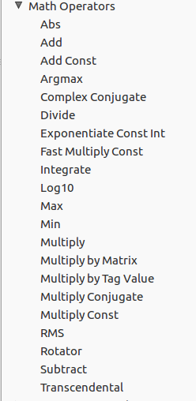. 
 	
> Use mulitple signal generators from section [1.2.3](#123-a-general-waveform-generator) to add and subtract and multiply to form new waveforms.  We'll add the examples here!


[↑ Go to the Top of the Page](#) ......[Next Lab](../01_1)
