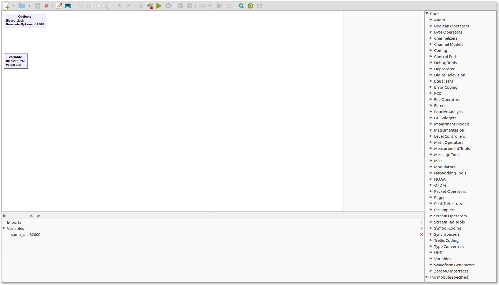
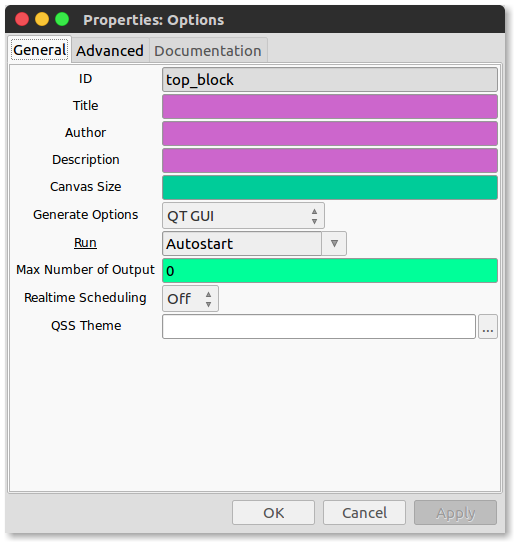
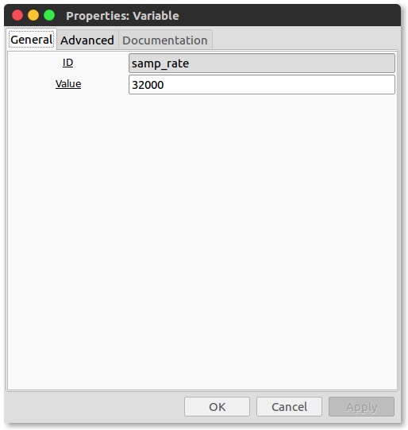

# Introduction to GNU Radio and Signals

This page shall guide you through our primary tool -- GNU Radio. GNU Radio is very popular and robust SOftware defined radio package. It is open source and is relatively very easy to use. All "coding" is done using flowgraphs comprised of  interconnected Digital Signal Processing (DSP) blocks. Most commonly used blocks come predefined as part of the software package however  one can program their own blocks as well. 


<!-- TOC -->

- [Introduction to GNU Radio and Signals](#introduction-to-gnu-radio-and-signals)
    - [Installation Guide](#installation-guide)
    - [Getting Started with GNU Radio](#getting-started-with-gnu-radio)

<!-- /TOC -->

## Installation Guide

It is relative very easy to install *if you are installing on Linux*. We woudl recommend working on linux however installing on a macOS or windows system is, albiet very hard, possible. First, we install dependences and change directory to the appropriate one: 

```bash
	sudo apt-get install git
	sudo apt-get install libyaml-dev
	sudo apt-get install libssl-dev
	sudo apt-get install python-dev
	sudo pip install pyopengl pyopengl_accelerate
```
In your home directory make a directory where we would install gnuradio:

```bash
	mkdir ~/sdr
	cd ~/sdr
```

To always have the most recent version of the sofware, we use *PyBOMBS*. It is a package manager with all the latest version version of the sdr software. We install the package manager and then we add the 'recipes' to the package manager:

```bash
	sudo apt-get install python-pip
	sudo pip install --upgrade pip
	sudo pip install pybombs
	pybombs recipes add gr-recipes git+https://github.com/gnuradio/gr-recipes.git
	pybombs recipes add gr-etcetera git+https://github.com/gnuradio/gr-etcetera.git 
	pybombs recipes list
```

Install ``gnuradio`` and the hardware drivers for gnuradio, ``gr-osmosdr``:

```bash
	pybombs prefix init ~/gnuradio -a myprefix #kind of tells the package manager the directory where to arrange all installs within
	pybombs install gnuradio gr-osmosdr
```
Add the environmental variables script to ``.bashrc``

```bash
	echo "source ~/gnuradio/setup_env.sh" >> ~/.bashrc
```
Sanity check as to whether the hardware is working (tunes to an local FM radio station at 100.1 Mhz) 

```bash
	rtl_fm -f 100.1e6 -M wbfm -s 200000 -r 48000 - | aplay -r 48k -f S16_LE
    
	#alteratively
	rtl_test -t
```
## Getting Started with GNU Radio

We start start right away by typing ``gnuradio-companion`` in the terminal:


This opens the window with the gnuradio workspace:



The “Options” block at the top left is used to set some general parameters of the flowgraph, such as metadata of the flowgraph like the title, author, etc., the graphical user interface (GUI) for widgets and result displays, or the size of the canvas on which the DSP blocks are placed. Right-click on the block and click on Properties (or double-click on the block) to see all the parameters that can be set. Below the Options block is a “Variable” block that is used to set values to variables that are used throughout the flowgraph like the sample rate, e.g.,\\(F_s = 32000 Hz\\) 

 