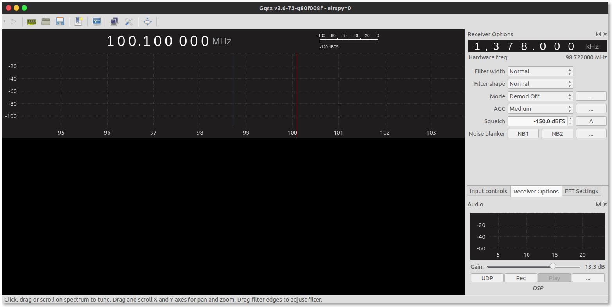

# 1. Software Defined Radio - Hardware

In [Lab 1](../01/) we learnt how to work around GNU Radio Companion (GRC) and simulate signals and instruments. We shall now step into the real world with real signals. 

<!-- TOC -->

- [1. Software Defined Radio - Hardware](#1-software-defined-radio---hardware)
    - [1.1. Introduction](#11-introduction)
    - [1.2. GQRX - It's cool](#12-gqrx---its-cool)
    - [1.3. GNURadio FM](#13-gnuradio-fm)
    - [1.4. Fun SDR/GNU Radio things](#14-fun-sdrgnu-radio-things)

<!-- /TOC -->

## 1.1. Introduction

A "simplified" diagram of the device which we shall be using is shown below:

Simplying this further for a general SDR hardware including the energy converstions:

(EM Waves)))) >-(Antenna)-->(Amplifier)--->(Local Oscillators + Filters)-->(Analog to Digital Convertor)-->(networking control: usually USB)--->[Computer]

Radio Waves excite electrons in the antenna and induces a current. The frequencies the antenna is most sensitive to is determined by the geometry of the antenna's design. The electric current is then initially amplified a bit. This amplifier is generally a "Low Noise Amplifier" because we do not want any new insertions into out antenna signal from the local electronincs. Processing a signal at a fixed frequency gives a radio receiver improved performance so thus a local oscillator (LO) is used. It is an electronic oscillator used with a mixer to change the frequency of a signal. This frequency conversion process, also called heterodyning, produces the sum and difference frequencies from the frequency of the local oscillator and frequency of the input signal. The desired frequency is then filterd out and if required amplified again. The last step is the most crucial step where-in the signal is digitized to be sent to the computer to be maniplated by our gnuradio code! 

Before we code on our own we shall this useful application called GQRX

## 1.2. GQRX - It's cool

[GQRX](http://gqrx.dk) is an application written is gnuradio. It acquired data from the dongle and has a set of preset options to manipulate said signals. It can even store raw data for custom decoding.

First, we make sure our dingle is plugged into the USB see if it is detected by the computer by typing  ``airspy_info``. If we installed all software correctly it should return information about the dongle and no errors. If everything is in order the type in terminal:

``
gqrx
``
It will open a window that looks like this. 

The hardware setting window shoudl automatically detect the dongle if not chose ``AIRSPY`` from the drop down. 

## 1.3. GNURadio FM

## 1.4. Fun SDR/GNU Radio things

