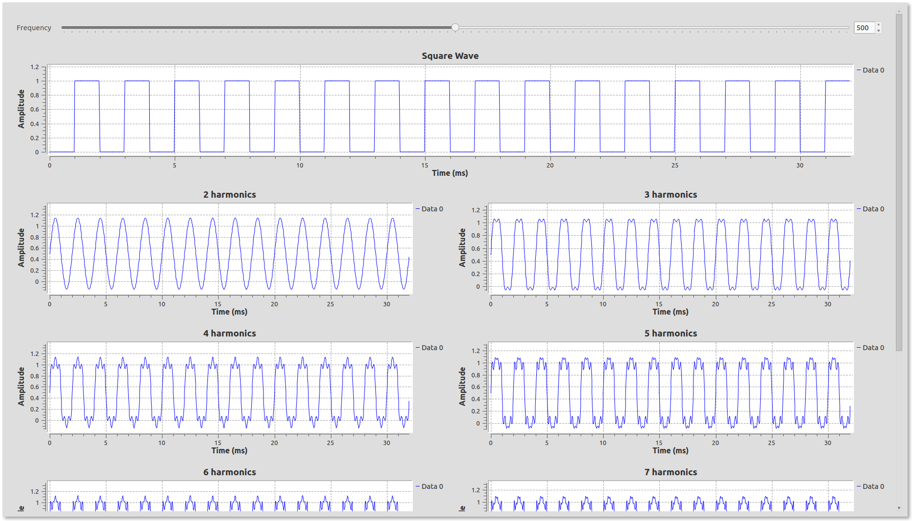
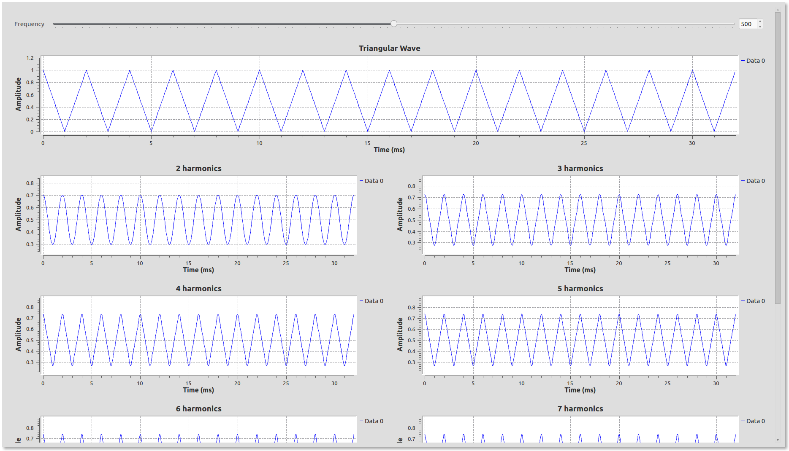
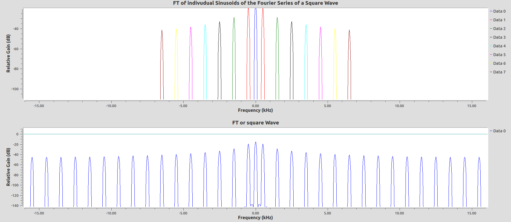
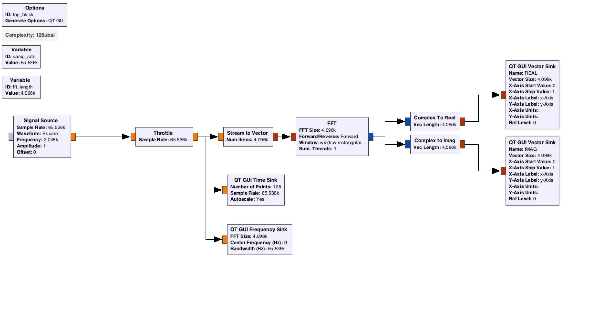

# 1. Fourier Analysis

Fourier Analysis is a very powerful tool that comes into play when we discuss periodic signals. Colloquially, a periodic signal repeats.  

<!-- TOC -->

- [1. Fourier Analysis](#1-fourier-analysis)
    - [3.1. Introduction](#31-introduction)
    - [3.2. Fourier Series](#32-fourier-series)
        - [3.2.1. A Sqaure Wave](#321-a-sqaure-wave)
        - [3.2.2. A Triangle Wave](#322-a-triangle-wave)
        - [3.2.3. A Sawtooth wave.](#323-a-sawtooth-wave)
    - [3.3. Fourier Series and Fourier Transforms](#33-fourier-series-and-fourier-transforms)
        - [3.3.1. Fourier Transform](#331-fourier-transform)
        - [3.3.2. Example](#332-example)

<!-- /TOC -->

## 3.1. Introduction

Mathematically a signal $$x(t)$$ is periodic if there exists a positive constant $$T$$ such that:
$$
x(t) = x(t + T)
$$
for all values of $$t$$. The smallest value of $$T$$ for which this is true is called the fundamental period and is denoted $$T_o$$. The corresponding *fundamental frequency* is $$f_o = \frac{1}{T_o}$$. If $$T_o$$ is in seconds, then $$f_o$$ is in Hertz (Hz). The fundamental angular frequency is $$\omega_o = 2\pi f_o$$ and is measured in rad/sec.

[↑ Go to the Top of the Page](#)

## 3.2. Fourier Series

A Fourier series is an expansion of a periodic function f(x) in terms of an infinite sum of sines and cosines. The computation and study of Fourier series is known as harmonic analysis and is extremely useful as a way to break up an arbitrary periodic function into a set of simple terms that can be plugged in, solved individually, and then recombined to obtain the solution to the original problem or an approximation to it to whatever accuracy is desired or practical. [^1]

[^1]: http://mathworld.wolfram.com/FourierSeries.html

Mathematically in a simple sense an arbitrary function $$f(t)$$ can be decomposed as:

$$
f(x) = a_0 + \sum_{n=1}^{\infty} a_n cos(nx) + b_n sin(nx) 
$$ 

We shall explore this concept by making two waveforms using sinosoids:

### 3.2.1. A Sqaure Wave

From [Lab 1](../01/), we have the function generator. We use that to make a square wave of amplitude = 1. 

Mathematically it can be written as:

$$
f(x) = 
  \begin{cases} 
   0 & \text{if } -\pi \leq x \lt 0 \\
   1       & \text{if } 0 \leq x \lt \pi
  \end{cases}\ and\ f(x+2\pi)=f(x)
$$ 

Which has a period of $$2\pi$$.  For an arbitrary period P:
$$
f(x) = 
  \begin{cases} 
   0 & \text{if } -P/2 \leq x \lt 0 \\
   1       & \text{if } 0 \leq x \lt P/2
  \end{cases}\ and\ f(x+P)=f(x)
$$

The corresponding Fourier series of the square wave
$$
f(x) = \frac{1}{2} + \sum_{n=1}^{\infty} \frac{2}{(2k-1)\pi} sin[(2k-1)x] \\
\ \ \ = \frac{1}{2} + \frac{2}{\pi}sin(x) + \frac{2}{3\pi}sin(3x) + \frac{2}{5\pi}sin(5x) + \frac{2}{7\pi}sin(7x) + ... + + \frac{2}{n\pi}sin(nx)\ (\ n\ is\ odd)
$$

and for arbirary period P:
$$
f(x) = \frac{1}{2} + \sum_{n=1}^{\infty} \frac{2}{(2k-1)\pi} sin[\frac{2\pi}{P}(2k-1)x] \\
\ \ \ = \frac{1}{2} + \frac{2}{\pi}sin(\frac{2\pi}{P}x) + \frac{2}{3\pi}sin(\frac{2\pi}{P}3x) + \frac{2}{5\pi}sin(\frac{2\pi}{P}5x) + \frac{2}{7\pi}sin(\frac{2\pi}{P}7x) + ... + + \frac{2}{n\pi}sin(\frac{2\pi}{P}nx)\ (\ n\ is\ odd)
$$

Use more and more sources to add additional sinusoids and see what waveform you get after each added term.  How many terms until you're square wave looks good?  5?  10?  

It should look similar to this:

This type of analysis is important for digital design in that most digital signals are square waves, representing either a 1 or a zero.  So if your signal is at 10MHz, how fast should the electronics and design work?

[↑ Go to the Top of the Page](#)

### 3.2.2. A Triangle Wave

The triangular wave is defined as:
$$
f(x)=|x|\  for\ -1\lt x \leq 1\ and\ f(x+2)=f(x)\ for\ all\ x
$$

Its corresponding fourier series is:

$$
f(x) = \frac{1}{2} - \sum_{n=1}^{\infty} \frac{4}{(2k-1)^2\pi^2} cos[(2k-1)\pi x] \\
= \frac{1}{2} - \frac{4}{\pi^2}cos(\pi x) - \frac{4}{9\pi^2}cos(3 \pi x) - \frac{4}{25\pi^2}cos(5\pi x) - ...
$$

Make a flowgraph out of the expanded terms above and check the output after each operation. Do you need more or fewer components to begin looking like a triangle wave as compared to a square wave?  Why do you think that is?  

It should give an output like this:

 

---

### 3.2.3. A Sawtooth wave.

Now mathematically define a sawtooth wave and find it's Fourier series expansion.  Then create its flow-graph, again with more and more Fourier components.  Again, do you need more/less Fourier components as compared to a square or triangle wave?  

## 3.3. Fourier Series and Fourier Transforms

We segue into the concept of Fourier transforms directly by seeing how they relate to fourier series. First some mathematics to associate familiarity, the Fourier transform of $$x(t)$$ is given by:

$$
X(\omega) = \int_{-\infty}^{+\infty} x(t) cos(\omega t)dt -i \int_{-\infty}^{+\infty} x(t) sin(\omega t) = \int_{-\infty}^{+\infty}x(t)e^{-i\omega t}dt
$$

When x(t) is periodic and has a Fourier series expansion, this integral is pulling out those sines and cosines in the expansion.  

In more detail: For the complex representation of a Fourier series of a periodic function $$x(t)$$ :

$$
x(t) = \sum_{-\infty}^{\infty} c_n e^{jn\omega t}
$$

The co-effecients, $$ c_n $$ of $$ x(t) $$ (which  has the period $$ T $$ is given by the relation:

$$
c_n = \frac{1}{T} X(n\omega_o)
$$

where $$X(\omega)$$ is the Fourier transform and $$\omega_o = \frac{2\pi}{T}$$

**In summary, the Fourier series of a signal is a sum of sines and cosines. And, the Fourier transform decomposes the signal into it's its frequency components with their relative strength. This can be visually seen in a neat animation as shown below ( *credit: wikipedia* ) and in the next section**

[↑ Go to the Top of the Page](#)

### 3.3.1. Fourier Transform

Use the [Square Wave](../03/#13-a-sqaure-wave) and the [Triangle Wave](../03/#14-a-triangle-wave) flowgraphs from the previous exercise.

First use a ``signal source`` block to make a square wave and feed the signal into a ``QT frequency sink``

**The Frequency Sink takes the Fourier Transform of the incoming signal and plots the output of the fourier transform**

Place another ``QT Frequency Sink`` and change the number of inputs to the number of Fourier series sinusoids you have in your flowgraph and feed all the sinusoids (vis-a-vis the individual Fourier series terms) into the frequency sink 

The output looks like this:

The colored peaks are the Fourier transforms of the individual sinusoids. Do they align with the Fourier Transform of the pure square wave? If you add more terms of the Fourier series to the sink, how do they compare?

Repeat this exercise for the triangle wave.

We've been taking Fourier transform of the signal every time we see a plot with frequency in the time axes. 

 We shall visit Fourier transforms in detail again that in Lab 5. 

### 3.3.2. Example

We can also think of this to use gnuradio-companion to graphically get the Fourier components of a signal using a Fourier transform.  Create a flow-graph with a signal source->FFT(Fourier transform)-> complex to real/imag -> vector sinks.  The output of the real-part contains the cosine components of the transform.  The imaginary part contains the sine components of the Fourier expansion.  

It is also helpful to plot the time series to see what your input is and the frequency sink to make it easier to just read off the frequency of the components.  

An example flowgraph looks like:
 

The FFT block is a special block which does the Fourier transform really fast. Play around with the FFT block and your general waveform generator from Lab 1 to take their Fourier transform.  Use this to read off the Fourier series coefficients.  This can still be used with a periodic signal with much less obvious structure.

---

[↑ Go to the Top of the Page](#) ......[Next Lab](../04)

