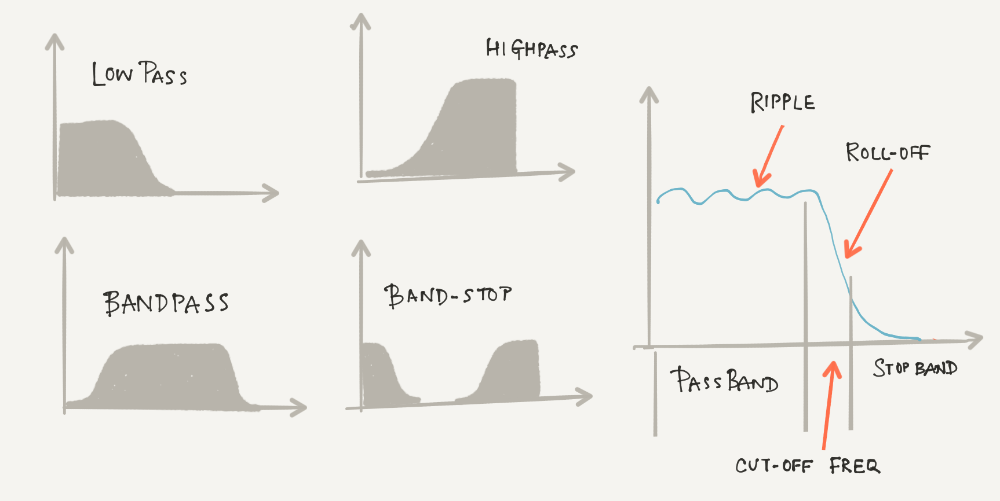
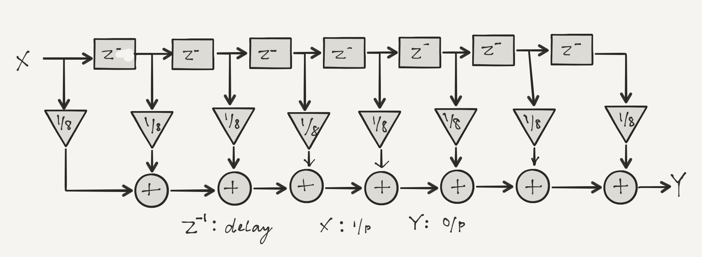
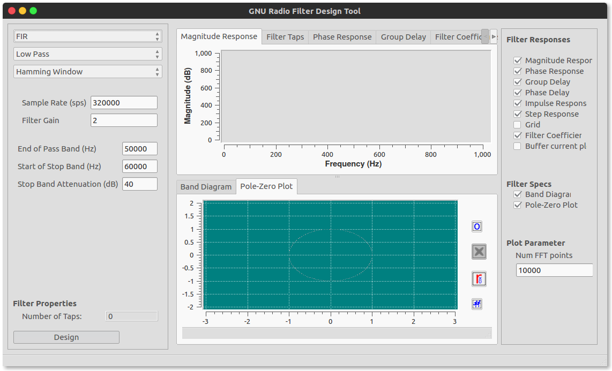
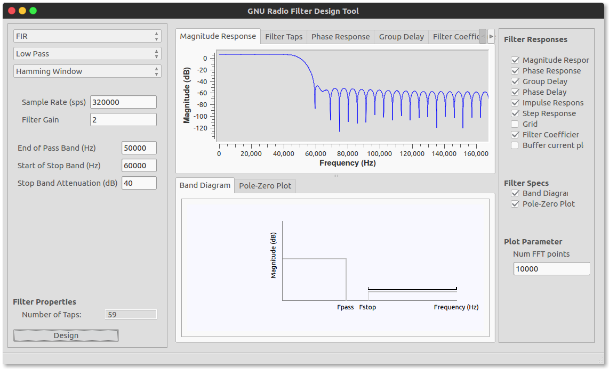
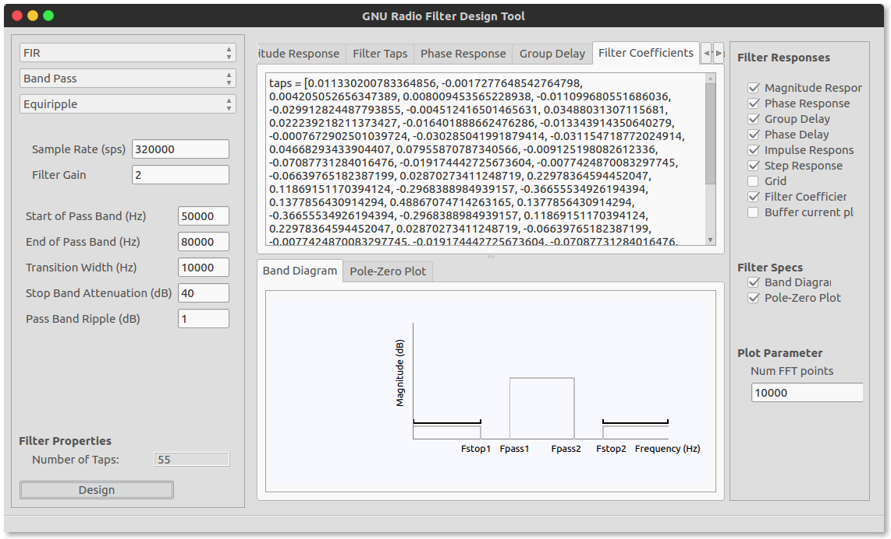
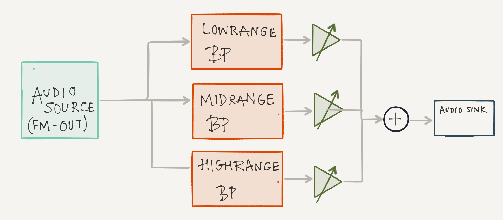
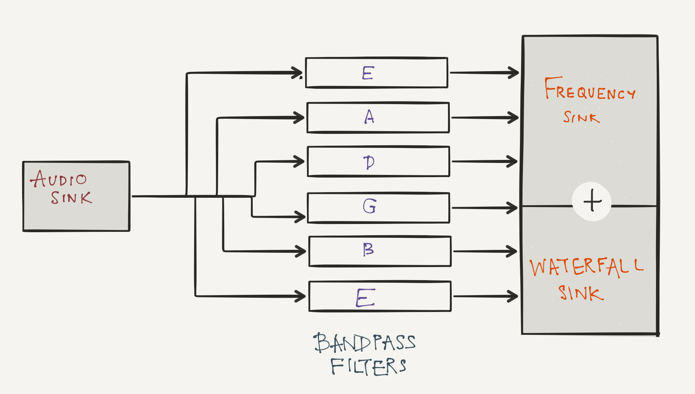
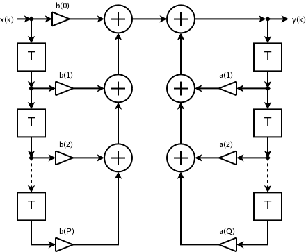

# 4. Digital Filters

A filter changes the nature of the signal. A digital filter does so by manipulating a discretized signal. 

<!-- TOC -->

- [4. Digital Filters](#4-digital-filters)
    - [4.1. Introduction](#41-introduction)
        - [4.1.1. Filter Terminology](#411-filter-terminology)
    - [4.2. Moving Average Filter](#42-moving-average-filter)
        - [4.2.1. Exercise 1: Noise Reduction](#421-exercise-1-noise-reduction)
    - [4.3. FIR: Finite Impulse Response Filters](#43-fir-finite-impulse-response-filters)
        - [4.3.1. Exercise 2: Extracting Fundamental Frequencies from a Guitar/Piano Chord (C Major)](#431-exercise-2-extracting-fundamental-frequencies-from-a-guitarpiano-chord-c-major)
        - [4.3.2. Exercise 3: Digital Audio Equalizer](#432-exercise-3-digital-audio-equalizer)
        - [4.3.3. Exercise 4: Guitar Tuner](#433-exercise-4-guitar-tuner)
    - [4.4. IIR: Infinite Impulse Response Filters](#44-iir-infinite-impulse-response-filters)
        - [4.4.1. Classic Analog Filters](#441-classic-analog-filters)
        - [4.4.2. IIR Filter Design](#442-iir-filter-design)

<!-- /TOC -->

## 4.1. Introduction

As we have seen in the previous lab every signal in the time domain has an equivalent representation in the frequency domain by way of the Fourier transform. Information in a signal can be distinctly displayed as a function of the three parameters: time, frequency and phase. Different filters are designed to manipulate the said information in the signal with respect the different parameters.

Use for example the signal x as a function of time:
$$ x(t) = A cos(\omega t + \phi) $$

we can then create filter that when the signal passes through it changes the amplitude, to get $$ y(t) = B(\omega) x(t) $$.  The output will have a different amplitude compared to the input, depending on the frequency.  

[↑ Go to the Top of the Page](#)

### 4.1.1. Filter Terminology

- Cut-off Frequency: The frequency around which the signal either passes or stops
- Low Pass: A filter which allows only frequencies *below* the cutoff frequency  to pass
- High Pass: A filter which allows only frequencies *above* the cutoff frequency  to pass
- Band Pass: A filter which allows only frequencies *between* a range of frequencies to pass
- Band Stop: A filter which allows only frequencies *no within* a range of frequencies to pass
- Pass-Band: The range of frequencies through which the signal passes
- Stop Band: The range of frequencies through which no signal passes ideally.
- Ripple: Oscillations from the expected straight line. 
- Roll-off: The region between the end of the pass-band and a stop-band.
- Finite Impulse Response (FIR) Filter:  A filter which has no feedback (or has feed-back that is carefully accounted for), such that an impulse (delta function or step) will have an output that eventually goes to zero.  
- Infinite Impulse Response (IIR) Filter:  A filter with feedback. 

[↑ Go to the Top of the Page](#)

## 4.2. Moving Average Filter

A moving average filter does exactly what its name suggests. It is a very commonly used filter and very simple in its implementation. It performs optimally in the time domain particularly functioning to reduce random noise. It is mathematically represented as: 

$$
x_{n-point-average} = \frac{x[M]+x[M-1]+ . . . + x[M-(n-1)]}{n} \\
M\ is\ the\ M^{th}\ index
$$

*NOTE: A moving average filter is a simple finite impulse response(FIR) filter. Specifically it is a low-pass filter.  You can also think of this as a convolution.*

[↑ Go to the Top of the Page](#)

### 4.2.1. Exercise 1: Noise Reduction

Use a sine wave from the ``signal source`` and add noise to it (Discussed in Lab 1). Pass this to a 8-tap moving average filter. The flowgraph should resemble this diagram:

Observe the signal before and after the filtering.
Cascade multiple 8 point average filters (i.e. connect end to start). This will require saving just your filter as a 'hier block' with two 'pad sources' and two 'pad sinks' (why two?).  Once the block is compiled, reload the blocks (refresh button in gnuradio-companion).  There should now be a "GRC Hier Blocks" section with your block named.  How does the signal change adding more and more averaging?

*Note: There are two options for 'heir' block with or without 'QT GUI' appending heir. Choose the one without the 'QT GUI. Male sure you have to disabled blocks in your floegraph *

[↑ Go to the Top of the Page](#)

## 4.3. FIR: Finite Impulse Response Filters

"A finite impulse response (FIR) filter is a filter whose impulse response (or response to any finite length input) is of finite duration, because it settles to zero in finite time. This is in contrast to infinite impulse response (IIR) filters, which may have internal feedback and may continue to respond indefinitely (usually decaying)."[^source]

[^source]: https://en.wikipedia.org/wiki/Finite_impulse_response#Window_design_method

The flow diagram of an FIR filter is shown below, $$ x[n]\ and\ y[n] $$ are inputs and outputs respectively. $$ z^{-1} $$ is the unit delay and $$ b_n $$ are the filter coefficients. 

FIR filters are mathematically fast and relatively easier to design and implement digitally. 

We shall design FIR filters using the graphical tool that ships with gnuradio. In the taskbar (move mouse to the top of the window) click on ``tools`` and then ``filter design tool``

We shall design all our filters by graphically using this tool. Theoretically, there are several methods employed to design a filter. The most common used method is by designing a window function.  In the window design method, one first designs an ideal filter which may have an infinite time response (IIR) and then truncates the impulse response by multiplying it with a finite length window function. The result is a finite impulse response filter whose frequency response is modified from that of the IIR filter. Multiplying the infinite impulse by the window function in the time domain results in the frequency response of the IIR being convolved with the Fourier transform of the window function [^source]

For us, this GUI does everything behind the scenes. We observe the response of the designed filters in the window and use the necessary taps/filter-coefficients in the FIR block. 

GNU Radio has two kinds of FIR filter blocks. A decimating and interpolating FIR filter which reduce(by dividing) and increase(by multiplying) the number of samples of the filtered signal respectively. When we design our filter we simply copy and paste the Filter Taps in the ``Taps`` field of the filter block properties. 

[↑ Go to the Top of the Page](#)

### 4.3.1. Exercise 2: Extracting Fundamental Frequencies from a Guitar/Piano Chord (C Major)

A chord is the sound produced by playing three  or more notes together. We can use fourier transform to extract the frequencies that make up those chords. Build a flow-graph that simply uses an ``audio source``, converts the float output to complex and sends that into a ``Frequency Sink``

Once ready, let's play the C-Major chord. It is the C (= 261.63Hz) , E (= 329.63Hz) and G (= 392Hz). Notice that the frequency spectrum shows more than just the three fundamental frequencies. They show the harmonics of the three frequencies mentioned above! Recall from Fourier series , these harmonics including the fundamental frequencies when added together makes the waveform that forms the music note. The amplitudes of these harmonics for the same note is different for different instruments because the "timbre" i.e. the waveform produced by every instrument is different!

Now let us extract just the fundamental frequencies by implementing low pass filters to have:

1. C-E-G Fundamental Frequency ( use cut-off frequency 456 Hz)
2. C-E Fundamental Frequency ( use cut-off frequency 361 Hz)
3. C Fundamental Frequency ( use cut-off frequency 296 Hz)

The outputs of the filters in the frequency sink should look like this by zooming in:

You may want to save the filtered audio to disk. Look for the the appropriate "sink" block to do so! You can try this with any other chord. Change the filters accordingly. [Click here](https://en.wikipedia.org/wiki/Piano_key_frequencies) for the frequency of every key on the piano. 

Fun Fact: Using Fourier transforms and some cool filtering you can transcribe any chords in any any music piece. For example, [deciphering the "mystery" opening chord of the Beatles' *Hard Day's Night*](https://www.wired.com/2008/10/how-a-professor/)

[↑ Go to the Top of the Page](#)

### 4.3.2. Exercise 3: Digital Audio Equalizer 

Let us try and construct a simple digital equalizer. I shall present the primer for a very simple 3 band equalizer divided into three frequency bands created by three band-pass filters:
- Low range: 20Hz – 250Hz
- Mid-range: 250Hz – 4kHz
- High-range: 4kHz – 20kHz
 
 Attach this to FM Radio flow-graph before the ``audio sink``
 The gnuradio flow-graph will follow this diagram: 

You can of course have more than three frequency channels, you can google commonly used frequency divisions in commercial equalizers.

**NOTE**: "Ancient" stereos/cassette players and old audio workstations in music studios have analog equalizers designed using analog filters. If you look at the frequency sink of the output of our digital Equalizer you can observe that the filters work *really really* well. Digital filters can be very very precisely designed. The roll-off(or transition width) can be as narrow as you want!

[↑ Go to the Top of the Page](#)

### 4.3.3. Exercise 4: Guitar Tuner

Let us be more ambitious and design a Digital Guitar Tuner in GNU Radio. It is rather simple and very similar to the equalizer:  It is a series of band-pass filters **centred** on the fundamental frequency of the strings. The Fundamental frequencies of the open guitar string in a standard tuning:

| String    |   Frequency   |
|-----------|---------------|	
|1 (E)      |	329.63 Hz   |	
|2 (B)  	|   246.94 Hz   |	
|3 (G)      |	196.00 Hz   |	
|4 (D)      |	146.83 Hz   |	
|5 (A)      |	110.00 Hz   |	
|6 (E)      |	82.41 Hz    |

The flow-graph should resemble this diagram:

Choose an appropriate bandwidth. Add frequency and waterfall sinks for each string. What type of window will you use? 

[↑ Go to the Top of the Page](#)

## 4.4. IIR: Infinite Impulse Response Filters

The flow diagram of an IIR filter is shown below, $$ x[n]\ and\ y[n] $$ are inputs and outputs respectively. $$ z^{-1} $$ is the unit delay and $$ b_n $$ are the feed-forward filter coefficients, and $$ a_n $$ are the feed-back coefficients.

### 4.4.1. Classic Analog Filters

Analog filters built using traditional circuit elements like inductors, resistors, capacitors, transistor, op-amps, etc. have mathematical approximations that allow us to implement them digitally. There are 4 types each excelling in one parameter while under-performing in another:

- *Butterworth*: Flattest pass-band but a poor roll-off rate.

- *Chebyshev*: Some pass-band ripple but a better (steeper) roll-off rate. Chebyshev filters where the ripple is only allowed in the pass-band are called type 1 filters. Chebyshev filters that have ripple only in the stop-band are called type 2 filters , but are are seldom used. Chebyshev filters have a poor phase response.

- *Elliptic*: Some pass- and stop-band ripple but with the steepest roll-off rate.

- *Bessel*: Worst roll-off rate of all four filters but the best phase response.

IIR or Infinite response filters are the closest digital implementations of these filters. 

### 4.4.2. IIR Filter Design

Now create an IIR filter to again pull out the fundamental frequency of the C-chord.  Do this again using the 'Filter design tool'.  When you use an IIR filter, the design is now in 'normalized' units of 'cycles/sample'. To get units of frequency, you must multiply by the sample rate/2 (fs/2) you are using.  So with a sample rate of 48000, you divide the frequency you want by 24000.  For an IIR filter you can use the "IIR Filter" block, where the feed-forward taps are the "b's" and the feed-back taps are the "a's".  Be sure to also select the 'new' style of taps.  How many coefficients (taps) are required for an IIR filter in comparison to an FIR filter with a similar response function?  More? Less?  Why?

[↑ Go to the Top of the Page](#) ... [Next Lab](../05)
