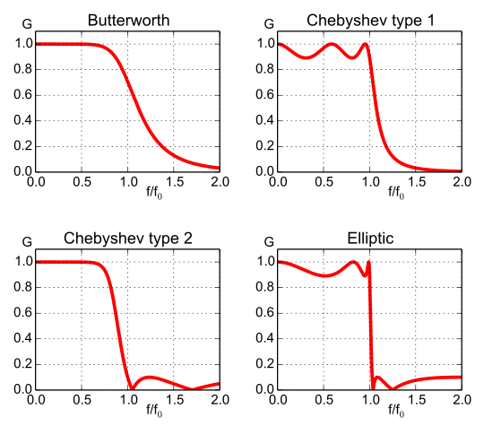
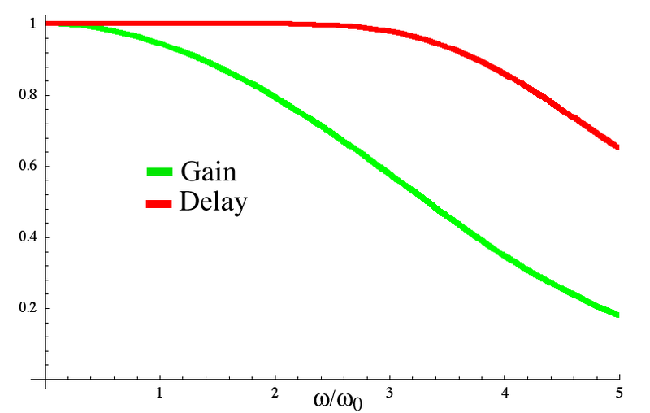

# 1. Digital Filters

A filter changes the nature of the signal. A digital filter does so by manipulating a discretized signal. 

<!-- TOC -->

- [1. Digital Filters](#1-digital-filters)
    - [1.1. Introduction](#11-introduction)
        - [1.1.1. Filter Terminology](#111-filter-terminology)
        - [1.1.2. Classic Analog Filters](#112-classic-analog-filters)
    - [1.2. Moving Average Filter](#12-moving-average-filter)
        - [1.2.1. Exercise 1: Noise Reduction](#121-exercise-1-noise-reduction)
    - [1.3. FIR: Finite Impulse Response Filters](#13-fir-finite-impulse-response-filters)
        - [1.3.1. Exercise 2: Extracting Fundamental Frequencies from a Guitar/Piano Chord (C Major)](#131-exercise-2-extracting-fundamental-frequencies-from-a-guitarpiano-chord-c-major)
        - [1.3.2. Exercise 3: Guitar Tuner](#132-exercise-3-guitar-tuner)
        - [1.3.3. Exercise 4: Digital Audio Equilizer](#133-exercise-4-digital-audio-equilizer)
    - [1.4. IIR: Infinite Impulse Response Filters](#14-iir-infinite-impulse-response-filters)

<!-- /TOC -->

## 1.1. Introduction

As we have seen in the previous lab every signal in the time domain has an equivalent representation in the frequency domain by way of the fourier transform. Information in a signal can be disitnctly displayed as a function of the three parameters: time, frequency and phase. Differnt filters are designed to manipulate the said information in the signal with respect the different parameters. 

### 1.1.1. Filter Terminology

- Cut-off Frequency: The frequency around which the signal either passes or stops
- Low Pass: A filter which allows only frequencies *below* the cutoff frequency  to pass
- High Pass: A filter which allows only frequencies *above* the cutoff frequency  to pass
- Band Pass: A filter which allows only frequencies *between* a range of frequencies to pass
- Band Stop: A filter which allows only frequencies *no within* a range of frequencies to pass
- Pass-Band: The range of frequencies through which the signal passes
- Stop Band: The range of frequencies through which no signal passes ideally.
- Ripple: Oscillations from the expected straight line. 
- Roll-off: The region between the end of the pass-band and a stop-band.

### 1.1.2. Classic Analog Filters

Analog filters built using traditional circuit elements like inductors, resistors, capacitors, transitor, op-amps, etc. have mathematical approximations that allow us to implement them digitally. There are 4 types each excelling in one parameter while underperforming in another:

- *Butterworth*: Flattest pass-band but a poor roll-off rate.

- *Chebyshev*: Some pass-band ripple but a better (steeper) roll-off rate. Chebyshev filters where the ripple is only allowed in the passband are called type 1 filters. Chebyshev filters that have ripple only in the stopband are called type 2 filters , but are are seldom used. Chebyshev filters have a poor phase response.

- *Elliptic*: Some pass- and stop-band ripple but with the steepest roll-off rate.

- *Bessel*: Worst roll-off rate of all four filters but the best phase response.

IIR or Infinite response filters are the closest digital implementations of these filters. 

## 1.2. Moving Average Filter

A moving average filter does exacty what its name suggests. It is very commonly used filter and it's very simple in its implementation. It performs optimally in the time domain particularly functioning to reduce random noise. It is mathematically represented as: 

$$
x_{n-point-average} = \frac{x[M]+x[M-1]+ . . . + x[M-(n-1)]}{n} \\
M\ is\ the\ M^{th}\ index
$$

*NOTE: A moving average filter is a simple Fininte impulse response filter. Specifically it is a bad low-pass filter*

### 1.2.1. Exercise 1: Noise Reduction

Use a sine wave from the ``signal source`` and add a noise to it (Discussed in Lab 1 and 1.1). Pass this to a 8-tap moving average filter. The flowgraph should resemble this diagram:

Observe the signal before and after the filtering.
Cascade multiple 8 point average filters (i.e. connect end to start). How does the signal change?

## 1.3. FIR: Finite Impulse Response Filters

"A finite impulse response (FIR) filter is a filter whose impulse response (or response to any finite length input) is of finite duration, because it settles to zero in finite time. This is in contrast to infinite impulse response (IIR) filters, which may have internal feedback and may continue to respond indefinitely (usually decaying)."[^source]

[^source]: https://en.wikipedia.org/wiki/Finite_impulse_response#Window_design_method

The flow diagram of an FIR filter is shpwn below, $$ x[n]\ and\ y[n] $$ are inputs and outputs respectively. $$ z^{-1} $$ is the unit delay and $$ b_n $$ are the filter co-effecients. 

FIR filters are mathematically fast and 

We shall design FIR filters using the graphical tool that ships with gnuradio. In the taskbar (move mouse to the top of the window) click on ``tools`` and then ``filter design tool``

We shall design all our filters by graphically using this tool. Theorotically, there are several methods employed to design a filter. The most common used method is by designing a window function.  In the window design method, one first designs an ideal IIR filter and then truncates the infinite impulse response by multiplying it with a finite length window function. The result is a finite impulse response filter whose frequency response is modified from that of the IIR filter. Multiplying the infinite impulse by the window function in the time domain results in the frequency response of the IIR being convolved with the Fourier transform of the window function [^source]

For us, this GUI does everything behind the scenes. We observe the response of the designed filters in the window and use the necessary taps/filter-co-effecients in the FIR block. 

The FIR Block: 

### 1.3.1. Exercise 2: Extracting Fundamental Frequencies from a Guitar/Piano Chord (C Major)

A chord is the sound produced by playing three  or more notes together. We can use fourier tranform to extract the frequencies that make up those chords. Build a flowgrpah that simply uses an ``audio source`` and send the output through an ``FFT`` block into a ``Frequency Sink``

Once ready, let's play the C-Major chord. It is the C (= 261.63Hz) , E (= 329.63Hz) and G (= 392Hz). Notice that the frequency spectrum shows more than just the three fundamental frequencies. They show the harmonics of the three frequencies mentioned above! Recall from fourier series , these harmoics including the fundamental frequencies when added together makes the waveform that forms the music note. The amplitudes of these harmonics for the same note is different for different instruments because the "timber" i.e. the waveform produced by every instrument is different!

Now let us extract just the fundamental frequencies by implementing low pass filters to have:

1. C-E-G Fundamental Frequency ( use cut-off frequency 456 Hz)
2. C-E Fundamental Frequency ( use cut-off frequency 361 Hz)
3. C Fundamental Frequency ( use cut-off frequency 296 Hz)

You may want to save the filtered audio to disk. Look for the the appropriate "sink" block to do so! You can try this with any other chord. Change the filters accordingly. [Click here](https://en.wikipedia.org/wiki/Piano_key_frequencies) for the frequency of every key on the piano. 

Fun Fact: Using Fourier tranforms and some cool filtering you can transcribe any chords in any any music piece. For example, [deciphering the "mystery" opening chord of the Beatles' *Hard Day's Night*](https://www.wired.com/2008/10/how-a-professor/)

### 1.3.2. Exercise 3: Guitar Tuner

Let us be more ambitious and design a Digital Guitar Tuner in GNU Radio. It is rather simple: It is a series of bandpass filters centred on the fundamental frequency of the strings. The Fundamental frequencies of the open guitar string in a standard tuning:

| String    |   Frequency   |
|-----------|---------------|	
|1 (E)      |	329.63 Hz   |	
|2 (B)  	|   246.94 Hz   |	
|3 (G)      |	196.00 Hz   |	
|4 (D)      |	146.83 Hz   |	
|5 (A)      |	110.00 Hz   |	
|6 (E)      |	82.41 Hz    |

The flowpraph should resemble this diagram:

Choose an appropriate bandwidth. Add frequency and waterfall sinks for each string. What type of window will you use? 

### 1.3.3. Exercise 4: Digital Audio Equilizer 

Let us try and construct a simple digital equalizer. I shall present the primer for a very simple 3 band equalizer divided into three frequency bands created by three bandp-ass filters:
- Low range: 20Hz – 250Hz
- Mid-range: 250Hz – 4kHz
- High-range: 4kHz – 20kHz
 
 Attach this to FM Radio flowgraph before the ``audio sink``
 The gnuradio flowgrpah will follow this diagram: 

You have more than three frequency channels, you can google commonly used frequency divisions in commercial equalizers.

## 1.4. IIR: Infinite Impulse Response Filters