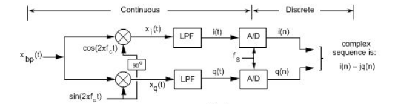
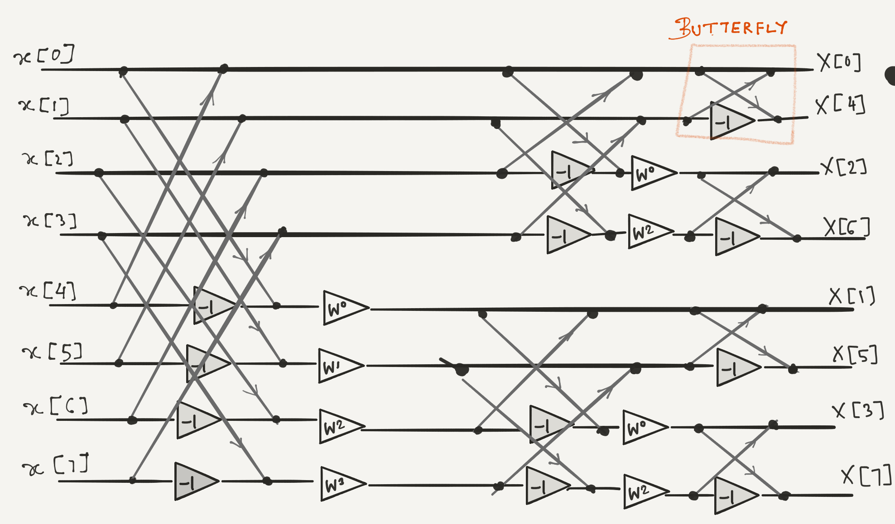
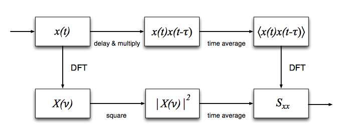
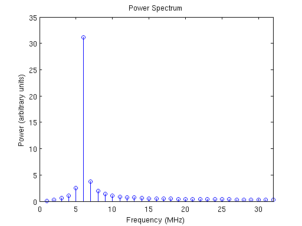
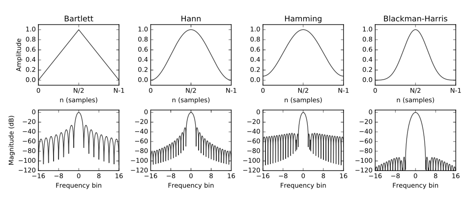
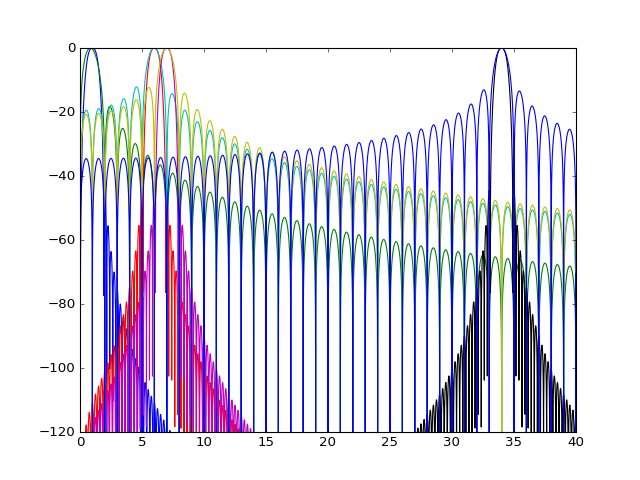
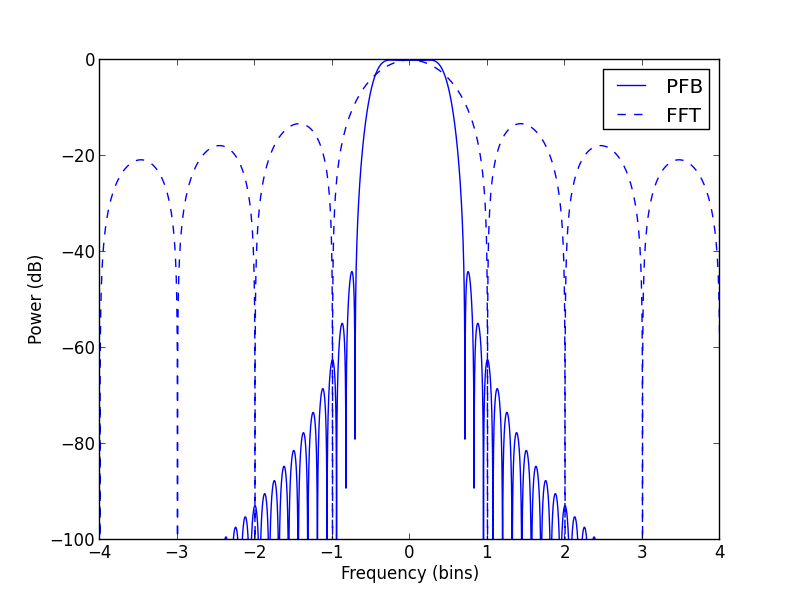
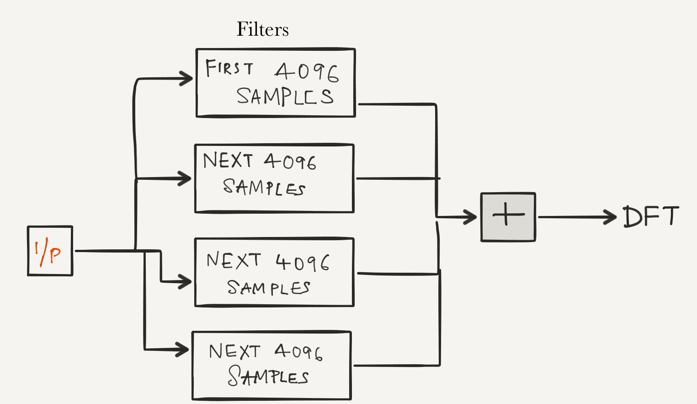

# 5. Fourier Analysis - Expert Mode! 

As we observed in the previous labs and theory with their corresponding exercises, Fourier analysis is a very important tool in Signal Processing. 

<!-- TOC -->

- [5. Fourier Analysis - Expert Mode!](#5-fourier-analysis---expert-mode)
    - [5.1. Fourier Transform Pairs](#51-fourier-transform-pairs)
    - [5.2. IQ signals *or* What is up with all the Complex Numbers](#52-iq-signals-or-what-is-up-with-all-the-complex-numbers)
    - [5.3. Fast Fourier Transforms (FFT)](#53-fast-fourier-transforms-fft)
        - [5.3.1. 8 Point Fast Fourier Transform **[OPTIONAL]**](#531-8-point-fast-fourier-transform-optional)
    - [5.4. Fourier Analysis in Radio Astronomy: A Spectrometer](#54-fourier-analysis-in-radio-astronomy-a-spectrometer)
    - [5.5. The Spectrometer's purpose](#55-the-spectrometers-purpose)
    - [5.6. The Window Field in the gnuradio FFT block](#56-the-window-field-in-the-gnuradio-fft-block)
    - [5.7. Spectral Leakage & Polyphase Filter Bank (PFB)](#57-spectral-leakage--polyphase-filter-bank-pfb)
    - [5.8. Final Upgrade: PFB Spectrometer](#58-final-upgrade-pfb-spectrometer)
    - [5.9. Saving Data](#59-saving-data)
                    - [Image Credits](#image-credits)

<!-- /TOC -->

## 5.1. Fourier Transform Pairs

Let us revisit fourier transform by exploring the concept through their various properties. Refer to this [Table of Fourier Transform Pairs and Properties](http://www.ws.binghamton.edu/fowler/fowler%20personal%20page/EE301_files/FT%20Tables_rev3.pdf) and implement in gnuradio the following :

1. Fourier Transform a Sinusoid and 
2. Fourier transform of the sinusoid delayed by one sample
3. The output of the Fourier transform of a constant source of the value 1 is a dirac delta function. Find the FT of the dirac delta function and the dirac delta function time delayed.
4. Fourier transform of $$ e^{h\omega_o t} $$
5. Demonstrate the convolution property (use square wave) *Hint: Inverse Fourier transform can be implemented by choosing ``reverse`` in the ``Forward/Reverse`` Option. Hint: The output should be a triangle wave*
6. Fourier transform  a square pulse of different widths (i.e. tau *refer lab 1.3.1*)

Try to implement other properties from the link of fourier transform pairs and properties as well. 

**NOTE: Use the ``FFT`` Block for the above exercises. Use complex sources. The `FFT` block takes an input vector and outputs a complex vector. Use to appropriate stream to vector and complex to real/imaginary convertor blocks where necessary**

**The power of the FFT output is given by multiplying the complex output of the FFT by its complex conjugate**

[↑ Go to the Top of the Page](#)

## 5.2. IQ signals *or* What is up with all the Complex Numbers

If you remember from the [lab 2 introduction](../02/#21-introduction) an SDR dongle passes the incoming signal through a mixer where the receiver sets the frequency you observe by setting the "LO" frequency which is mixed (multiplied) with the incoming signal.  The signal is actually mixed with 2 LO's, one cosine wave and one sine wave.  This is called quadrature sampling, and is done so that it is possible to distinguish a signal that is some frequency(say 2MHz) below the "LO" frequency, or 2MHz above the LO frequency.  With just a single mixing and one measurement, one just cannot distinguish between a signal at those two frequencies.

[Credit](#image-credits)

[See this jupyter notebook](I_Q_quadrature_sampling.html) for an 
introduction to the idea.  

Now demonstrate IQ processing in gnuradio.  We can demonstrate this at much lower frequencies as well.  Set the sample-rate to 48kHz.  Create 2 tones(cosine signals), one at 8kHz, one at 12kHz.  Create your LO at 10kHz, one a cosine and one a sine.

Try using the two signals independently, and added together, this is the overall 'signal'.
Now multiply this signal by the cosine and the sine "LO's".  This now will become your IQ signal.  In gnuradio, this is passed into a "float to complex" block,
where the cosine LO mixed signal is the real, and the sine multiplied is the imaginary.  This can then be passed into a sink.  

Add different syncs along the way, looking at just the cosine ("I") or sine ("Q")
multiplied signals.  With just the single incoming tone, demonstrate that you can in fact recover it after mixing.  Do we need a filter?  Where? Add one if needed.  

[↑ Go to the Top of the Page](#)

## 5.3. Fast Fourier Transforms (FFT)

The Discrete Fourier Transform for N samples is given by:

$$
X[k] = \sum_{n=0}^{N-1} x[n] \cdot e^\frac{-2\pi kn}{N}
$$

Evaluating the DFT's sums directly involves $$ N^2 $$ complex multiplications and N(N−1) complex additions, of which $$ O(N) $$ operations can be saved by eliminating trivial operations such as multiplications by 1. Multiplications are particularly expensive computations. 

Fast Fourier transform algorithms drastically reduce the computational complexity. The radix-2 Cooley–Tukey algorithm is a widely used FFT algorithm.  In comparison to the traditional DFT it can compute the same result with only $$ \frac{N}{2}log_2(N) $$ complex multiplications (again, ignoring simplifications of multiplications by 1 and similar) and $$ Nlog_2(N) $$ complex additions. 

[Check out this link for a derviation of the Cooley-Tukey Algorithm](http://en.dsplib.org/content/fft_dec_in_freq.html)

[↑ Go to the Top of the Page](#)

### 5.3.1. 8 Point Fast Fourier Transform **[OPTIONAL]**

The DFT implemented through a Cooley-Tukey Decimation in frequency FFT algorithm has the flowgraph shown below.

Use appropriate Constant multiplies and and adders to construct the above in gnuradio. Are the outputs the Valid frequency domain results? 

[↑ Go to the Top of the Page](#)

## 5.4. Fourier Analysis in Radio Astronomy: A Spectrometer

You now have the tools necessary to create the digital signal processing for a Spectrometer for a radio telescope.  A spectrometer:

1.  Separates the incoming radio signal into individual frequency components (breaks it into individual cosine wave amplitudes and phases at each frequency)
2.  Measures the power in each of the cosine waves.
3.  Integrates (Averages) to get get a more precise measurement of the power at each frequency.

Use GnuRadio to create the signal processing chain to achieve this. Use an osmocom airspy source.  Use an FFT to separate frequency components. 

[↑ Go to the Top of the Page](#)

## 5.5. The Spectrometer's purpose

As mentioned above, A spectrometer is used to record and measure the spectral content of signals, such as radio waves received from astronomical sources. Specifically, a spectrometer measures the power spectral density (PSD, measured in units of $$W Hz^{−1}$$) of a signal. Analysis of spectral content can reveal details of radio sources, as well as properties of the intervening medium like galactic neutral hydrogen. The Power Spectral Density is given by the Wiener-Kinchin theorem for wide sense stationary signals as: 

$$
S_{xx}(\nu) = \int^{\infty}_{^-\infty}r_{xx}(\tau) e^{-2\pi i\nu\tau}d\tau
$$
$$
r_{xx}= E[x(t)(x(t-\tau)]
$$
and in the fourier domain
$$
S_{xx}(\nu)=E[|X(\nu)|^2]
$$
E[] stands for the expected value i.e. the mean

There are therefore two distinct classes of spectrometers: 1) ones that approximate $$ S_{xx} (k) $$ by first forming the autocorrelation, then taking a Fourier transform and 2) those that first convert into the frequency domain to form X(k) before evaluating $$ S_{xx} (k) $$. These are Autocorrelation Spectrometers and  Fourier Tranform Filterbanks respectively. 

[Credit](#image-credits)

The one we made above is a fourier transform filterbank. A filterbank is simply an array of band-pass filters, designed to split an input signal into multiple components. A spectrometer is referred to as a *analysis filterbank* where the output of each filter is squared and averaged.

## 5.6. The Window Field in the gnuradio FFT block

The spectrometer we constructed effectively works as a array of band-pass FIR filters. If you recall FIR filters their design involves something called window-functions designed to optimise the filter response. The Discrete Fourier transform as it were uses the rectangular window function across each frequency channel. The response is non-ideal leading to spectral leakage i.e. the signal showing up in neighboring frequency channels. Below is a Demonstration of DFT leakage - a tone at 5.1MHz, sampled at 128MHz, and Fourier-transformed with 64 points, appears to varying levels in all the output frequency bins.

[Credit](#image-credits)

This can be improveed by using better windowing functions to properly define the frequency channel. Below are some commonly used windowing functions. 

[Credit](#image-credits)

Note the frequncy response, the main lobe width and the attenuation of the side lobes determine how well defined are the frequency channels. The figures below illustrate the difference. The second plot shows the window response in some frequency bins, the ones with the higher sidelobes as responses of boxcar windows and the the lower sidelobes are of the hann window.

[Credit](#image-credits)

In your spectrometer flowgraph, change the window field in the FFT block and observe how the response of a tone ( a sinusoud signal ) changes for different windows. 

[↑ Go to the Top of the Page](#)

## 5.7. Spectral Leakage & Polyphase Filter Bank (PFB)

Despite the appropraite windowing, spectral leakage persists, moreover there is something called a scalloping loss. Scalloping loss is the loss in energy between frequency bin centres due to the non-flat nature of the single-bin frequency response. 

The polyphase filter bank (PFB) technique is a mechanism for alleviating the aforementioned drawbacks of the straightforward DFT. The PFB produces a flat response across the channel and provides excellent suppression of out-of-band signals, as shown below.

[Credit](#image-credits)

"Instead of taking an N-point transform directly, a block of data of size N x P = M is read, and multiplied point-by-point with a window function (in other words, the data is 'weighted'). As mentioned before, the shape of the window function determines the shape of the single-bin frequency response. Since we wish the single-bin frequency response to resemble a rectangular function as much as possible, we choose its Fourier Transform pair, the sinc function, as our window function. Once the multiplication is done, the block of data is split into P subsets of length N each, and added point-by-point. This array is then passed to a regular DFT routine to get an N-point transform that exhibits less leakage. This method is presented graphically below"[^1]

[^1]: [https://casper.berkeley.edu/wiki/The_Polyphase_Filter_Bank_Technique](https://casper.berkeley.edu/wiki/The_Polyphase_Filter_Bank_Technique)

[Credit](#image-credits)

The same process, mathematically:

$$
y(n) = \sum_{p=0}^{P-1} x(n + pN) h(n+pN)
$$
Where, where the sub-filter coefficients $$h(n + pN)$$ correspond to what are called P-tap 'polyphase sub-filters'. The N such polyphase sub-filters that make up this operation, together with the following DFT stage, are collectively called a 'polyphase filter bank' ('PFB'). A realization of this filter bank is shown below:

[↑ Go to the Top of the Page](#)

## 5.8. Final Upgrade: PFB Spectrometer

Add the polyphase filters to your spectrometer just before taking the FFT. Refer to the diagram above, the dotted squares are simply band-pass FIR filters. Use a hann/hamming window. 

[↑ Go to the Top of the Page](#)

## 5.9. Saving Data

Save the spectrometer data for science! (Use File Sink)

###### Image Credits

1. The windows, the two types of spectrometers,fft vs hann resposnse [https://arxiv.org/pdf/1607.03579.pdf](https://arxiv.org/pdf/1607.03579.pdf)
2. The PFB flowgraph, spectral leakage demo, [https://casper.berkeley.edu/wiki/The_Polyphase_Filter_Bank_Technique](https://casper.berkeley.edu/wiki/The_Polyphase_Filter_Bank_Technique)
3. IQ diagram [https://www.dsprelated.com/showarticle/192.php](https://www.dsprelated.com/showarticle/192.php)

[↑ Go to the Top of the Page](#) ... [Next Lab](../06)
