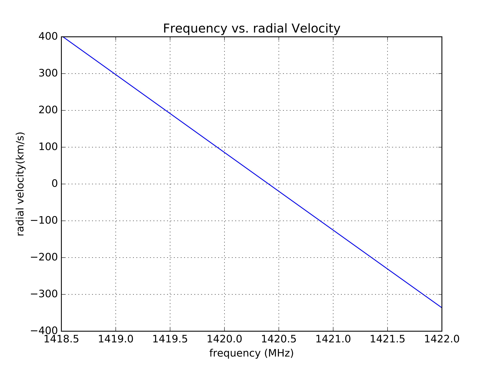
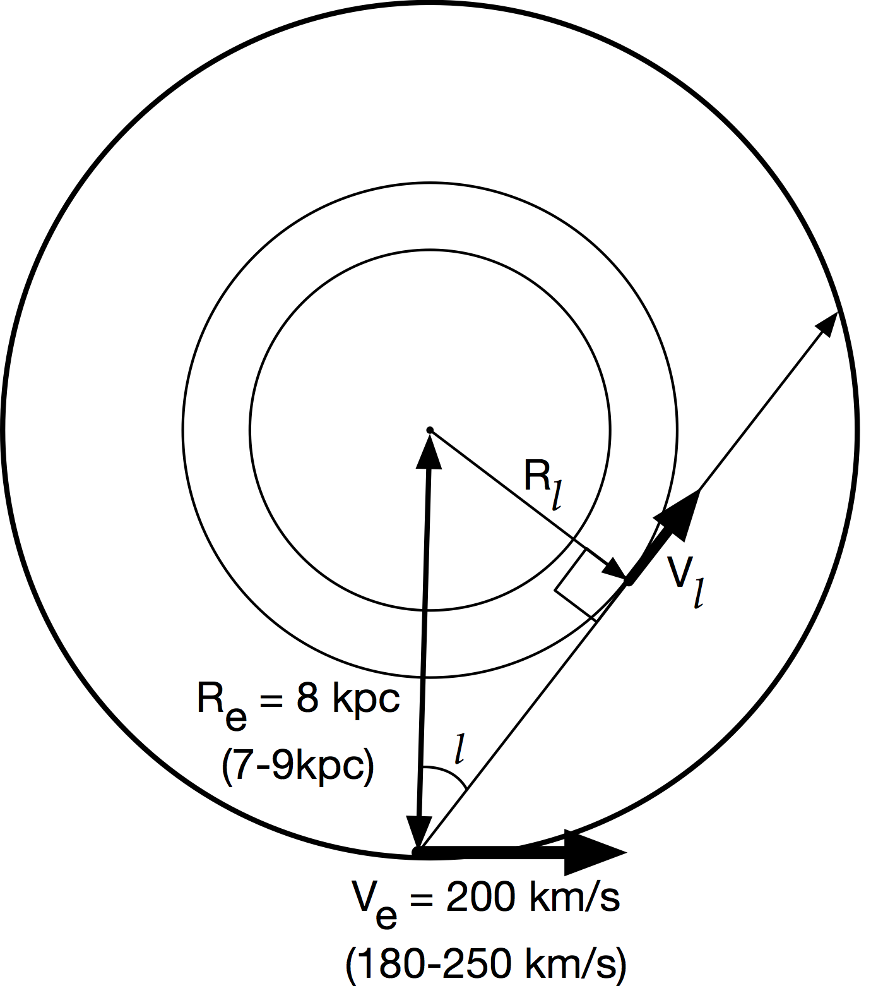

# Observations

Lets use our telescopes! 

<!-- TOC -->

- [Observations](#observations)
    - [7.1  Data Processing of telescope files with Python](#71--data-processing-of-telescope-files-with-python)
    - [7.2 Drift map of the sky.](#72-drift-map-of-the-sky)
        - [7.2.1  Create a map from the data.](#721--create-a-map-from-the-data)
    - [7.3 Milky Way Rotation Curve.](#73-milky-way-rotation-curve)
        - [7.3.1 From Frequency to Velocity](#731-from-frequency-to-velocity)
        - [7.3.2 From Velocities relative to us to relative to the Milky Way center.](#732-from-velocities-relative-to-us-to-relative-to-the-milky-way-center)
    - [7.4  Beam pattern measurement](#74--beam-pattern-measurement)
    - [7.5  Horn improvements](#75--horn-improvements)
    - [7.6 Combining multiple horns](#76-combining-multiple-horns)

<!-- /TOC -->

## 7.1  Data Processing of telescope files with Python

*Install Python*

```bash
sudo apt install ipython ipython3
sudo apt install jupyter
```

Depending on the kind of sink you use you have different kind of data formats - if you used the file sink defualt block the data is saved with``float32`` data in 4096 point vectors encoded in binary. You can reduce that data as follows:

Open IPython from the folder/directory where your data is saved:

```bash
ipython --pylab
```

```python

##########################
## Read and reshape data
##########################

spec1 = np.fromfile("data",dtype=np.float32) # open 'data' in read mode and put all the data as a numpy array spec
spec1.shape # .shape shows the array dimension.shape
spec = spec.reshape((-1,4096)) # reshapes data into stacks of 4096 points
spec.shape # get the shape of the new array. The frst number is the number of time intgrations

###############################################
# save to a text file to open on excel or other
###############################################

np.savetxt("reshapeddata.csv",np.transpose(spec),delimiter=',') # saved to file reshapeddata.txt with a comma delimiter

##############################################
# Plot
############################################## 

plot(spec[0]) # plots the first integration
plot(spec[i]) # plots the i-th integration

```

If you used the Out-of-Tree Module ``hdf5_sink`` your data is in the hdf5 (heirarchichal data format) format. You can reduce it such: 

``` python 
##########################################
# Import h5py package to read hdf5 files
##########################################

import h5py

###########################################
# read file into a variable
###########################################

f = h5py.File('2017-07-19_16.12.50.h5','r')   

list(f.attrs)         # check the metadata attributes
list(f.attrs.items()) # check the metadata attributes and their values
f.items()             # list the datasets in the file

#############################################
# extract the spectrum data and 
#############################################

spectrum = f['spectrum'][:]          # get the spectrum data

###############################################
# save to a text file to open on excel or other
###############################################

np.savetxt("reshapeddata.csv",np.transpose(spectrum),delimiter=',') # saved to file reshapeddata.txt with a comma delimiter

############################################
# plot
############################################

fstart = f.attrs['freq_start']       # get the start frequency
fstep = f.attrs['freq_step']         # get the stop frequency 
flength = 4096                       # the number of points on the frequency axis, vector length
freq = np.arange(flength)*fstep + fstart         # make an array of x-axis indices
rcParams['axes.formatter.useoffset'] = False 
plot(freq, 10.0*np.log10(spectrum.mean(axis=0))) # log was taken before putting into the sink


```

## 7.2 Drift map of the sky.  

For each observation, it is important to calibrate the telescope.  Be sure to make a pointing of the ground which is the 'hot' load, and a pointing at an 'empty' portion of the sky.  One can then calibrate the data into units of temperature.  This will aid in combining multiple observations. 

One way to map out the sky is to point the telescope (south along the meridian is a good choice) at a single location, and record data for an extended period of time.  This is called drift scanning.  When you observe, be sure to enter the pointing information, your location, telescope information, and anything else you can think of into the file being saved and/or in your notebook.  You won't remember anything you don't write down.  

After 24hrs of data (shorter is ok, but won't be the entire sky), you can then point the telescope to a new elevation, stepping by 10 degrees (about half the telescope beam width if you know it) and recording data again.  In this way, in a few weeks one can map out the entire sky.  

### 7.2.1  Create a map from the data.  

In the python directory:

[https://github.com/WVURAIL/dspira/tree/master/python](https://github.com/WVURAIL/dspira/tree/master/python)

There is a program called map_h1_hdf5_drift.py.  This can be used to take your
drift scan data, and turn it into 2 csv (excel) files, h1map.csv and hitmap.csv.

to use the program:

```
usage: map_h1_hdf5_drift.py [-h] [-d DIRECTORY] [-n LONGITUDE] [-l LATITUDE]
                            [-g GAIN] [-t TSYS]

Create map from h5 files in a directory

optional arguments:
  -h, --help            show this help message and exit
  -d DIRECTORY, --directory DIRECTORY
                        directory where hdf5 data files are stored
  -n LONGITUDE, --longitude LONGITUDE
                        longitude on earth, in degrees. Negative if west.
                        Defaults to Green Bank.
  -l LATITUDE, --latitude LATITUDE
                        latitude on earth, in degrees. Defaults to Green Bank.
  -g GAIN, --gain GAIN  csv File with gain solution
  -t TSYS, --tsys TSYS  csv file with temperature solution

```
So for example, create a directory 'my_observation' and then run:
```bash
python map_h1_hdf5_drift.py -d ~/my_observation/ -n -79.872 -l 39.659
```

will create the two csv files in your current directory.  If you haven't calibrated your data ahead of time, but ran the 'convert_to_temperature.py' to get a gain and tsys csv, us the '-g' and '-t' to point to where those files are stored.  

You can now open the two map files in excel, where a true map will be (h1map/hitmap).
To use python to make a plot, move the output csv files also into a new directory, say '~/my_observation_map/'

download the 'map_from_csv.py' file from the python directory, and run it like:

```
python map_from_csv.py -d ~/my_observation_map/
```

this should bring up a map you just made in galactic coordinates, and also save it to 'gal_map.pdf' in your current directory.  If you've made multiple observations with multiple maps, move all the csv files to that same directory (be sure they have unique names) and they will all be combined into the same map.  


## 7.3 Milky Way Rotation Curve.  

Use Stellarium or another program to make an observing plan.  Plan to point the telescope along the galactic equator, shifting by 10 degrees each time, and observing for 30s to 5 minutes at each pointing.  When you actually observe, be sure to enter the pointing information, your location, telescope information, and anything else you can think of into the file being saved.  You won't remember anything you don't write down.  

### 7.3.1 From Frequency to Velocity
The observations of the Neutral Hydrogen in the galaxy were made around its at rest frequency of 1420.40575177 MHz.  We observe it at different frequencies since it is moving relative to us in the galaxy.  We'll use the non-relativistic formula:

$$  \frac{ \lambda_o - \lambda_e}{\lambda_e} = \frac{\Delta \lambda}{\lambda} = \frac{v}{c} $$

where $$ \lambda_e $$ is the wavelength emitted, and $$ \lambda_o $$ is the wavelength observed.  To convert from frequency to wavelength, we can use the speed of light:
$$ c = \lambda f $$

to get:

$$ \frac{f_e - f_o}{f_o} c = v $$

where now $$f_e$$ is the frequency emitted, $$f_o$$ is the frequency observed, and c is the speed of light (300,000 km/s).

We can now convert our measurement of Power vs. frequency to Power vs. speed (use km/s) relative to us.  Does it matter what units are used for frequency?

See below for a plot of frequency vs. radial velocity for neutral hydrogen.




### 7.3.2 From Velocities relative to us to relative to the Milky Way center.  

What we want is the speed of the neutral hydrogen moving around the galactic center as a function of the distance away from the galactic center.  What we measure is not the velocity of the neutral hydrogen relative the galactic center, but instead relative to us along a given line of sight.  We can use as a given the speed of the earth around the galactic center as 200 km/s (current numbers are 180-250km/s) at a radius of 8 kpc (7-9 kpc).  (The speed of the earth around the sun is 30 km/s, so should be also taken into account for a more precise measurement, but we'll skip this for now.)

 

We'll use the *Tangent Point Method* to find the rotation speed at a given radius.  To do this, well assume that the fastest moving hydrogen along the line of sight for a given line of sight will be that which is closest to the center of the galaxy, since it will be also moving along the same line (See diagram).  With this assumption use the 'fastest' speed on a given line of sight (negative or positive) and convert it to a rotational velocity at that radius.  

The radius will be given by:

$$ R_l = R_e sin(l) $$

where $$ R_e $$ is the earth radius, and $$l$$ is the galactic longitude.  

The radial velocity will be given by:

$$ V_l = | V_{los} | + V_e sin(|l|) $$

Where $$ V_l $$ is the galactic rotational velocity, $$ V_{los} $$ is the maximal ( negative or positive ) velocity measured at that $$l$$, and $$ V_e $$ is the given earth radial velocity.  

You now have all the ingredients to create a plot of the galactic rotation curve for the Milky Way, plotting rotational velocity as a function of radial distance away from the center.  

What is the expected result?


## 7.4  Beam pattern measurement

## 7.5  Horn improvements

## 7.6 Combining multiple horns


----
[↑ Go to the Top of the Page](#)
